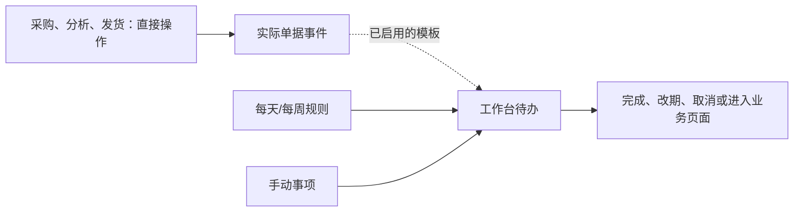

## 1. 要做什么 / 为什么

用户 2026-09-09 明确希望尽量减少标准流程约束，以工作台待办提供指导：采购创建后可添加周一09:00下单提醒，预计发货前两天确认生产、当天提醒发货，每天15:00提醒下载经营数据，周五提醒分析销售与库存。

目标：采购、分析和发货可随时直接操作；标准流程按规则生成可完成、改期或取消的待办，不以周度批次、固定星期或上一步提醒作为业务前提。工作台默认安排人的事项，经营摘要辅助。原库存/金额/权限及过账正确性规则继续成立。

用户已明确要求实现，本次交付W0：待办工作台、五类可配置规则、采购/发货预计发出日期与事件联动、后台可靠触发及权限验证。W1–W5的销售/FBA分析和计划内部分实发增强仍按开发计划独立推进；本次复用现有按货件分批发货，不自动联系供应商或在Amazon建单。原周度流程改为可选模板/分组，原销售、FBA快照、补货、采购和财务建设范围保留。

已明确时刻为周一09:00及每天15:00，其余默认全天待办、可配置时间；提醒时区默认上海。运输时长、安全量等未知参数不影响先实施待办。用户「实现吧」作为本次W0方案批准，提醒模板由用户在ERP按个人/单店范围启用，旧单可手动应用，未知经营参数不写入默认值。

## 2. 方案设计

详细规则见 [灵活作业与工作台待办](../../../../../docs/weekly-operations-workflow.md)，模块和导航见 [产品规划](../../../../../docs/erp-product-plan.md)，技术边界见 [技术方案](../../../../../docs/erp-technical-plan.md)，交付清单见 [开发计划](../../../../../docs/development-plan.md)。

| 对象 | 现状 | 变化 |
| --- | --- | --- |
| 人的待办 | Notification只有已读/未读；Job是机器任务；Approval是审批（apps/api/app/models.py） | 独立Task与待处理/已完成/已取消、日期/负责人/来源，不把通知已读或审批当完成 |
| 提醒规则 | 当前后台仅有队列任务恢复，无采购或周期提醒（worker.py、jobs/service.py） | 事件、日期偏移及固定周期规则，稳定实例身份与触发记录；独立后台调度 |
| 采购日期与动作 | 采购草稿/提交及expected_date，未区分用于提醒的实际发出日期 | 增加独立预计发货日和明确下单/实发等事件，不能用到货日减2天；提醒不要求先有补货方案 |
| 工作台 | WorkspacePage展示账号、通知及准备事项 | 逾期、今天、未来、未定日期，新增/完成/改期/取消和业务跳转；可选经营摘要 |
| 周度编排 | 前版设计要求每店周五批次及一组阶段 | 改为可选标签/分组，同周多次或无批次都可操作；不加星期/待办状态门禁 |
| 库存与供给 | 已有分批收发和内部库存账，外部FBA快照待建 | 保留计划/实发/接收与可售分层，未来增强独立交付，不阻塞待办或人工采购 |

模板：创建尚未下单的采购→下一次周一09:00一次性提醒；预计发货→前2个自然日的生产确认及当天发货；每天15:00→下载经营数据；每周五→销售/库存分析。周一09:00尚未过去可取当日；无发货日期可保存单据，对应规则待补日期。发货前两天及周五未指定时分时采用全天日期语义。

待办可手工创建，也可在模板启用后自动生成；单据保存不强制处理提醒弹窗。完成/取消某次周期事项不终止以后，修改可选本次或未来。取消全部提醒后，采购和发货仍可使用；任务完成不反向修改单据或库存。

事件提醒默认跟随业务日期；手动改期默认独立并保留覆盖。业务改期不复活已完成/已取消任务；分批只更新对应范围，部分发出不完成全部余量跟进。同一事件或周期实例重试不重复。过往待办保留历史，补生成不伪装已完成，也不补规则停用期间。

已下单/实发等明确事实可自动结束相应待办；点开页面、已读通知、普通备注、导入一个文件不推断下载/分析完成。默认下载和分析由人勾选。库存来源、数量、并发和权限校验仍由业务事务执行，未填齐货步骤可在实际发货操作中直接记录必要的来源和实发事实。

模块边界：新增tasks管理事项、规则与调度；supply保存实际单据并产生事件；reports保存导入事实；planning只负责后续可选分析/补货。待办生成/投递失败可恢复，不回滚已提交业务，不把调度计算放在浏览器。

## 2.5 结构健康度

结论：**现有业务模块可复用，不做预先微重构。** 本次实现新增tasks模块而不是扩写总路由或复用Job.status充当人的待办。

- models.py/routes.py已有通用基础，供应链和报表已拆模块；工作台类型及页面未来加待办聚合，不内置另一套业务算法。
- 待办路由/模型/规则/调度放tasks；现有业务模块只增加事务事件及必要的预计发货字段。
- 可卸载性：移除tasks的界面、规则及后台消费者后，采购/发货继续正常运行。通知及历史任务可只读保留，不级联删除业务或库存流水。

## 2.6 接口契约

本次W0接口包括第5节列出的任务CRUD、完成/取消/恢复、单次/未来改期、规则启停、关联单据与工作台聚合接口；统一权限、CSRF、版本冲突和幂等。旧通知接口保持已读语义，新业务类通知须关联来源并复核权限。

行为示例：2026-09-11新建未下单采购且预计09-18发货→09-14 09:00下单、09-16生产、09-18发货三项；重复提交→仍三项；预计发货改09-20→跟随日期的生产/发货改09-18/09-20，下单日期不变，手动覆盖和已完成项不变。

## 2.7 上线影响面

本次W0增加任务/规则/事件表和发货日期字段，接入独立后台调度及权限；旧通知不批量转待办，旧采购不强制套模板。数据库保存可恢复事件意图及触发游标，投递前验证当前日期/状态/权限。停机补生成启用期间实例并合并通知，不承诺停机时准时提醒。

## 3. 验收契约

下表为本次W0验收；明确标为W1–W4的后续增强不计入本轮完成范围。

| 输入/触发 | 期望结果 |
| --- | --- |
| 任意日期直接采购，无周报/周度批次/待办 | 可正常保存，不要求走标准流程 |
| 未处理下单/生产提醒，直接记录真实发货 | 校验权限、实际来源/数量后执行，不要求先勾选待办 |
| 09-11创建采购，预计09-18发货 | 一次下单09-14 09:00、生产09-16、发货09-18；可调整或逐项关闭 |
| 周一08:00或10:00创建采购 | 09:00未过去时取当日，否则取下一周一；预览清晰且可改期 |
| 新建已下单采购，或先于提醒时间登记实际下单 | 不产生未完成下单提醒，或将现有对应项完成；不关闭无关生产/发货项 |
| 预计发货日期缺失或与预计到货不同 | 可保存；缺失规则待补日期，不以到货日代替发货日、不伪造逾期 |
| 预计发货09-18改09-20 | 未完成且跟随日期的生产/发货改09-18/09-20；单次手动覆盖及已结束事项不被覆盖/复活 |
| 分批发出、取消部分余量 | 只完成/取消对应范围，其他有效批次继续跟进，不重复生成订单级和批次级催办 |
| 每日15:00、周五全天 | 每天含周末独立下载事项；周五另有分析事项，全天当日不因00:00经过而逾期 |
| 完成或取消某天下载事项，修改某次日期 | 下一期按原规则继续；可另外选择修改未来或停用整个规则 |
| 读通知、点击分析页面、手动完成待办 | 前两者不完成任务；手动完成不生成下单/出库或改库存 |
| 重试保存、重复调度、多人改期、停机重启 | 同一实例只生成一次，过期旧触发不投递；补生成保留原日期，停用期间不补，通知不堆积 |
| 待办有跨店来源、委派后撤权 | 列表、详情、通知及链接重新检查权限，不暴露撤权店铺内容 |
| 取消全部模板及待办 | 仍可直接采购/分析/发货，数量和权限校验仍生效 |
| W4后续：计划60实发50、接收30，另有采购未齐量 | 只50转在途、尚待收20；单据数量不因任务完成而改变，FBA可售仍取快照 |
| W1–W2后续：数据不足或零销量 | 自动估算标缺口，不输出虚假精确值；允许手工采购，不强制完成数据待办 |
| 外部操作边界 | 提醒仅在ERP；不会发送供应商消息或在Amazon后台建单 |

## 4. 推进步骤

- [x] 核对现有通知、后台任务与工作台，识别待办/周期/业务事件缺口。
- [x] 将标准步骤改为可选提醒，明确五类模板、改期/取消/拆批及业务解耦。
- [x] 同步产品、技术、使用说明与开发计划，优先W0待办和提醒，保留其他ERP范围。
- [x] 校验日期示例、文档链接和无强制周度门禁的一致性，并记录设计交付。

W0本轮实现与验收见第5节；W1–W5其余增强继续按开发计划推进。

## 5. W0 实施清单（本轮断点）

- [x] 模型/迁移、日期算法及待办API：权限、分页、版本冲突、完成/取消/恢复、手动改期与历史通过测试。
- [x] 规则、周期调度、采购/货件事件与改期/提前完成/取消：独立后台、幂等和恢复通过测试。
- [x] 工作台、提醒规则、关联待办及预计发货编辑：构建通过，实际页面可操作并可直达业务。
- [x] 独立评审、PostgreSQL并发/迁移与浏览器验收、使用说明及发布准备完成。

实施契约：GET/POST /tasks，GET/PATCH /tasks/{id}，POST /tasks/{id}/status；GET/POST /task-rules，PATCH /task-rules/{id}，POST /task-rules/templates，POST /tasks/apply-rules。所有写入沿用会话、CSRF和请求编号/版本保护。任务支持个人或单店范围，来源为采购/货件或分析页面；自动通知使用无敏感内容的站内提示并再次校验权限。规则修改默认只影响未来新实例，已有实例的单次改期独立；关联业务日期变动更新跟随日期的未结束待办。
