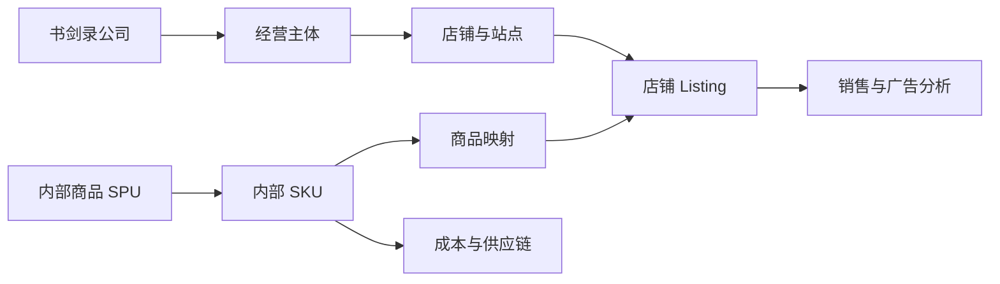

# 书剑录 ERP 功能规划

讨论稿 v0.2 · 2026-09-07

本轮开发里程碑、任务进度和资料准备见 [开发执行计划](development-plan.md)，实现方式见 [Web ERP 技术方案](erp-technical-plan.md)。

## 1. 产品定位

面向书剑录公司内部的中文 Web ERP，服务美国站亚马逊多店铺业务。用户已确认主要使用亚马逊 FBA。设计以经营利润、库存补货、采购头程和团队协作为主线。

系统重点回答：各店铺和商品赚多少钱；哪些商品需要补货或清库存；采购及在途货物到哪里了；广告花费是否有效；今天的问题由谁处理。

本轮假设销售主要以 USD 计价、采购支持 CNY，老板、运营、采购及财务多人使用。实际店铺名称、经营主体、仓库和人员规模待录入。海外仓、FBM 按实际需求扩展。

本轮范围已确认：原一期、二期功能全部建设；订单和广告由人员从亚马逊导出，再手动导入 ERP。API 自动同步留待后续，当前开发不依赖 Amazon 开发者资格或接口授权。

为完成库存和财务流程，建议库存、交易、结算及费用数据也通过报表导入；内部采购、收发货、物流和付款由人员在 ERP 登记。可按依赖分批开发，但不将采购、仓库、头程和财务月结移出本轮交付范围。

## 2. 功能总览

| 模块 | 核心功能 | 本轮建设内容 | 后续可选扩展 |
| --- | --- | --- | --- |
| 工作台 | 公司与店铺经营总览、趋势、异常及待办 | 销售、利润、广告、库存、资金占用、采购与物流进度、数据更新时间 | 目标预测 |
| 店铺与团队 | 店铺档案、经营主体、品牌、负责人和权限 | 多店铺切换、跨店汇总、角色与店铺权限、各类数据覆盖状态 | API 授权和同步状态 |
| 商品中心 | 内部商品、规格、图片、SKU 映射、Listing、成本历史 | 商品档案、跨店映射、费用估算、采购与头程批次实际成本、资料版本 | 新品开发项目 |
| 数据中心 | 文件导入、校验、去重、匹配、任务记录、来源追溯 | 订单、广告、成本、库存、财务报表导入；错误处理、重传更新、撤回、缺失区间提醒 | API 自动同步 |
| 销售与订单 | 销售趋势、订单查询、退款、商品与店铺对比 | 订单明细、状态、销量、销售额、退货退款和赔偿跟踪 | 按需增加更多履约方式 |
| 广告分析 | 花费、曝光、点击、归因销售、ACOS、ROAS、TACOS | 店铺、商品、活动和搜索词报表分析；预算手工维护及超支提醒 | 广告预算、竞价和否词写回 |
| 利润与财务 | 预估利润、周报月报、费用、对账及回款 | 商品/店铺利润、实际费用核算、月结、回款对账、应付和公共费用 | 按需扩展财务系统集成 |
| 库存与补货 | 国内仓、在途、FBA 库存、可售天数和预警 | 库存快照、仓库流水、补货建议、批次、盘点、库龄和资金占用 | 高级需求预测 |
| 采购与供应商 | 供应商、询价、采购单、交期、质检、付款 | 供应商档案、报价、采购审批、分批交货、入库、退货和应付 | 供应商评价和自动比价 |
| 头程与入仓 | 发货、装箱、物流节点、接收差异、运费分摊 | 从采购货物发出到 FBA 接收的全过程登记、差异处理和成本归集 | 物流接口和时效预测 |
| 运营与风险 | 运营任务、Listing 问题、账户健康和资料到期 | 异常待办、责任人、截止时间、处理记录、合规资料及账户问题台账 | 运营实验与自动采集 |
| 系统设置 | 币种、汇率、时区、费用规则、日志、导出和备份 | 基础配置、字段权限、审批配置、站内提醒、审计及恢复方案 | 外部消息渠道及更多集成 |

## 3. 关键模块设计

### 3.1 工作台：从结果定位到具体问题

顶部固定提供店铺、日期、负责人、币种筛选。支持“全部有权访问的店铺”和单店查看，跨店比较采用相同的时间及利润口径。

首页从上到下安排：

1. 指标卡：销售额、销量、预估经营利润、利润率、广告花费、TACOS。
2. 趋势区：销售与利润趋势、各店铺贡献、与上一可比周期的变化。
3. 商品清单：利润贡献高、亏损、即将断货和积压的商品。
4. 异常待办：缺成本、未匹配 SKU、广告异常、补货提醒和导入失败。
5. 数据状态：各店铺覆盖日期、最近更新时间及缺失来源。

每个汇总数字支持查看“公司 → 店铺 → 商品 → 明细 → 来源文件”。利润注明“预估”或“已核对”；数据不足时显示缺失项目，不能用零代替未取得的数据。

### 3.2 店铺与商品：统一商品身份，保留店铺差异

公司下维护经营主体、店铺、站点和负责人，允许同一负责人管理多个店铺。品牌与店铺独立维护。



- 内部 SPU 表示产品系列，内部 SKU 表示可独立采购、存储和核算的规格。
- Listing 维护店铺、站点、Seller SKU、ASIN、FNSKU、父子变体关系和履约方式；相关标识按实际数据允许暂缺。
- Seller SKU 在店铺和站点范围内识别，不能因字符串相同自动合并不同店铺的商品。
- ASIN 不作为跨店库存或成本的唯一关联键；跨店汇总通过已确认的内部 SKU 映射完成。
- 同一内部商品可以对应多个店铺 Listing，各店铺保留自己的售价、广告、库存和业绩。
- 商品维护负责人、供应商、尺寸重量、装箱数、采购周期、图片、资料附件和生命周期状态。
- 成本有币种、生效日期、来源和版本。修改成本后是否重算历史结果须显式选择并留下记录。

### 3.3 利润与财务：区分日常预估、期间汇总和月结

| 视图 | 用途 | 数据与状态 |
| --- | --- | --- |
| 日常预估利润 | 及时发现经营问题 | 订单、广告、有效成本和估算费用；标记数据缺口 |
| 周报 / 月经营汇总 | 团队复盘和商品比较 | 固定期间及计算版本；已核对费用和估算费用分列 |
| 月度已核对经营利润 | 核实该期间的经营结果 | 交易、结算、广告、仓储、成本及其他费用核对完成后结账 |

公司净利润还需纳入工资、办公、软件、服务等公司费用及明确的核算规则，不能把商品贡献利润直接命名为公司净利润。最终分类和核算口径由业务与财务共同确定。

建议的管理报表结构：

```text
商品净销售收入 = 商品销售收入 - 促销折扣 - 销售退款
商品贡献利润 = 商品净销售收入 + 归属商品的其他经营收入
             - 已售商品成本 - 已售商品分摊头程
             - 平台销售与履约费用 - 广告费用
             - 仓储及其他可归属经营费用
店铺经营利润 = 商品贡献利润汇总 - 店铺公共费用 + 未分配调整项
公司经营结果 = 店铺经营利润汇总 - 公司公共费用 + 公司级调整项
```

公式是待确认的分类框架。来源金额若已包含折扣或退款，应先标准化，不能再次扣减。销售税、代收代缴、赔偿、退货成本转回和汇兑单独分类，按确认后的口径纳入。

关键规则：

- 分别保存订单销售、财务入账和银行到账时间。利润和回款分开展示。
- 订单文件不能默认提供全部实际平台费用；缺少费用时使用明确的估算项，并展示覆盖率。
- 平台佣金、FBA 配送、仓储、入仓相关费用、移除/弃置和退款相关费用采用可配置类别，费率保留生效日期。
- 采购货款与已售商品成本分开记录，进货付款不直接等同于当期商品成本。
- 退货退款记录商品是否回到可售库存及处置结果，不能对所有退款自动转回全部成本。
- 广告报表花费与财务广告扣款建立核对关系，同一费用只计入一次利润。
- 店铺公共费用可保留为未分配；需要分摊时保存规则和原始总额。
- 保存 USD 原币和 CNY 换算，记录汇率来源、适用日期及版本。
- 月结支持“草稿 → 待核对 → 已结账”。已结账数据修改需反结账或生成有记录的调整版本。

### 3.4 广告分析：让广告花费与商品利润关联

本轮优先支持 Sponsored Products 报表，其他广告类型根据实际投放补充。商品、活动和搜索词使用各自对应的导出报表，不从汇总数据反推不存在的明细。

- 按店铺、内部商品、广告商品和 Campaign 分析。
- 指标包括曝光、点击、CTR、CPC、归因订单、归因销售、ACOS、ROAS 和 TACOS。
- ACOS = 广告花费 / 广告归因销售额；TACOS = 广告花费 / 同口径总销售额。分母为零时标记不可计算。
- 保留归因窗口、报告时间语义、广告类型、币种和更新时间，支持延迟数据回补。
- 广告归因销售与订单销售不简单相加；“总销售减广告销售”不能直接标记为精确自然销售。
- 无法可靠匹配商品的广告费用保留到店铺或活动层级，显示未分配金额。
- 无转化花费、ACOS 过高和预算偏离的阈值由团队配置，并显示观察周期和样本量。
- 本轮提供搜索词报表分析、预算手工维护、基于已导入花费的预算预警，以及调整建议和执行记录。预算、竞价和否词实际在亚马逊后台操作；API 写回留待后续。

### 3.5 库存与补货：同时管理数量、时间和资金

分别展示国内仓、海外仓（如有）、运输在途、FBA 入仓、FBA 可售、预留及不可售库存。内部运输记录与 Amazon 入仓状态关联到同一货物，避免重复统计在途数量。

本轮建议人工导入 FBA 库存和库龄报表，保存报表日期、库存状态和源文件。ERP 内部出入库通过业务单据登记，FBA 库存以导入快照及相关记录核对，不只靠销售订单倒推。

本轮提供库存快照、7/14/30 天销量、可售天数、断货及滞销预警。销量为零时标记无法按销量推算天数。预警显示快照日期，过期数据不能作为可靠的自动补货依据。

同时建设仓库和补货功能：

- 出入库、调拨、占用、释放、盘点和报损流水，接收差异单独处理。
- 商品采购周期、运输周期、入仓缓冲时间、安全库存和补货频率。
- 建议量按“目标期间需求 + 安全库存 - 该期间可用库存 - 预计按时到达的有效供给”计算，最低为零。
- 有效供给排除延误、取消及已计入库存的数量。同一批货在采购、运输和 FBA 入仓状态间迁移时不能重复扣除。
- 采购补货与 FBA 发货建议分别计算，考虑国内存货、起订量、整箱数、交期和仓容约束。
- 标记缺货期、促销、季节性、新品和销量突变，支持人工调整并说明原因。
- 库存成本、在途资金、周转及库龄分析。

跨店铺货权和库存独立记录，调配要有真实业务单据和受支持的履约路径，不能只修改所属店铺字段。

### 3.6 采购、仓库与头程：每一批货都有来源和去向

```text
补货建议 → 采购申请 → 审批 → 采购单 → 供应商生产
→ 分批到货 / 质检 → 国内入库 → 发货与装箱
→ 运输 / 清关 / 送仓 → FBA 接收核对 → 差异处理 → 批次成本归集
```

采购单维护供应商、商品、数量、币种、单价、交期、付款约定、附件和状态，支持部分交货、取消剩余量、退货及应付调整。

头程单维护物流商、运输方式、运单/提单号、箱数、重量体积、目标店铺、Shipment ID、预计和实际节点、费用与附件。

发货计划、装箱和费用在 ERP 登记；Amazon 货件仍由人员在卖家后台创建，再把 Shipment ID、运输节点及接收结果录入或导入 ERP。每次状态更新保留时间和附件依据。

一张采购单可分多次入库和发货，一票物流可包含多张采购单的商品。装箱明细关联发货批次及店铺商品，费用按选择的数量、重量、体积或其他合理规则分摊并保留过程。

审批按金额和角色配置。仓库作业深度按书剑录实际国内仓、供应商直发或第三方仓模式确定。

### 3.7 运营与异常：提醒要落实到责任人

包括商品负责人、Listing 资料、价格与活动记录、图片/A+ 任务、问题记录和复盘。新品立项、样品及完整项目看板后续扩展。

账户健康与合规问题记录类别、影响商品、截止时间、附件、负责人和处理过程。本轮采用人工登记和附件上传，问题状态由责任人维护。

Amazon Seller Central 已覆盖订单、库存、营销、支付及账户健康等业务入口；ERP 的建设重点是跨店汇总、内部供应链、成本核算和团队协作。[Seller Central 功能概览](https://sell.amazon.com/tools/seller-central)

异常流程：待处理 → 已认领 → 处理中 → 待复核 → 已关闭。支持重复提醒合并、处理备注和关闭依据。

## 4. 用户与权限

| 角色 | 主要工作 | 默认数据范围建议 |
| --- | --- | --- |
| 老板 / 管理层 | 公司经营、店铺比较、资金和审批 | 全公司汇总及授权明细 |
| 运营负责人 | 店铺业绩、商品、广告、补货和团队任务 | 管理范围内店铺 |
| 运营专员 | 所负责商品和店铺的日常操作 | 指定店铺及商品；成本和利润按授权开放 |
| 采购 / 供应链 | 供应商、采购、交期、物流和库存 | 授权采购与供应链数据 |
| 仓库人员（如有） | 收发货、库存和盘点 | 指定仓库；默认不开放利润 |
| 财务 | 成本、费用、应付、回款、对账和月结 | 授权主体及店铺的财务数据 |
| 系统管理员 | 账号、权限、配置、接口和审计 | 系统管理；经营数据查看权另行授予 |

权限覆盖功能、店铺/主体、敏感字段和操作类型。数据隔离在服务端执行，并同样作用于搜索、导出、附件、汇总报表和后台任务。

成本修改、导入撤回、财务调整、审批、月结和权限变更保留操作人、时间、前后值及原因。本轮通过文件交换亚马逊数据，不需要在 ERP 保存卖家后台登录凭据。

## 5. 数据接入与质量

订单和广告已确定采用人工导出、手动导入。以下库存和财务数据也建议采用文件导入，避免采购、补货和月结依赖接口接入。内部业务单据在 ERP 录入，标准化数据层为将来接入接口保留扩展能力。

| 数据 | 本轮维护方式 | 主要用途 |
| --- | --- | --- |
| 店铺与商品 | 手工维护、商品档案导入 | 店铺归属、商品身份和跨店映射 |
| 订单与销售 | 从亚马逊导出订单/发货报告后手动导入 | 订单、状态、销量和销售额 |
| 广告 | 从广告后台导出商品、活动、搜索词等实际使用的报表后导入 | 广告效果、预算预警和费用归属 |
| 交易、结算与费用 | 交易、结算、仓储及其他实际费用明细导入 | 费用核对、退款、赔偿、回款及月结 |
| FBA 库存与库龄 | 库存、库龄及接收/退货等所需明细导入 | 库存状态、补货、接收差异及退货分析 |
| 成本与采购 | 成本表导入；采购、质检、收货和退货在 ERP 登记 | 成本版本、采购进度、实际批次成本和应付 |
| 仓库与物流 | ERP 出入库、盘点、装箱、物流节点和费用登记 | 内部库存流水、在途数量和头程成本 |
| 回款与公共支出 | 手工登记或导入收款、付款及费用明细，上传凭证 | 银行到账核对、应付、公共费用和资金记录 |

订单及广告报表可支持销售分析和预估利润；要完成已核对利润和月结，还需实际交易、费用、成本及回款等数据。各指标只在所需来源齐备后标记完整。

本轮支持与实际样本匹配的 XLSX、CSV 和制表符 TXT/TSV 解析器，提供 ERP 自有成本、期初库存及费用模板。PDF 和其他凭证可作为附件保存，自动识别不列入当前要求。

导入流程：选择店铺及报告类型 → 上传 → 预检和覆盖范围预览 → 处理错误与映射 → 确认入库 → 展示结果及异常。

导入中心需要实现：

1. 按店铺和数据类型管理导入任务，支持一次上传多个文件，每个文件明确所属店铺及报告类型。
2. 识别表头、日期、币种和编码，展示行数、期间、金额汇总及预览；缺失元数据由用户明确填写，不静默猜测。
3. 显示新增、更新、重复、冲突和错误数量，确认后入库；错误行可下载修正，阻断错误处理前不发布该批次。
4. 保存源文件、导入人、时间及版本；从分析结果追溯到来源记录。
5. 重传或日期重叠时按对应报告的粒度处理。订单状态、广告归因回补及财务事件使用各自的更新规则，不将同一份数据重复累加。
6. 展示各店铺“订单更新到哪天、广告更新到哪天、库存快照日期、月结资料是否齐全”，可设置站内补导提醒。
7. 撤回和重算需验证权限及下游影响；不能删除其他批次有效记录，已结账期间按调整或反结账流程处理。
8. 图表、预警和利润在导入成功后刷新，并显示数据截至日期。区间汇总报表不生成伪造的每日数据。

不同来源若描述同一业务，例如订单报告和发货报告中的同一订单项，应建立关联并按统计口径选取，不能把两者销量相加。

质量要求：

- 保存源文件、批次、店铺、报告类型、覆盖期间、币种、时区、解析版本及文件摘要。
- 按来源真实粒度定义记录标识，不能只用 SKU 和日期去重订单或费用。
- 相同文件重传不重复记账；日期重叠时区分新增、更新和冲突；库存快照不累加。
- 订单状态和广告回补可更新；费用与退款按事件去重，不能覆盖真实的多笔交易。
- 缺成本、未匹配 SKU、未知费用类别、币种混用和日期缺口进入异常清单。
- 分别保存购买、发货、财务入账时间；报表有明确的统计日期与时区，处理美国时区夏令时。
- 原币与换算分开保存，不直接相加 USD 和 CNY。
- 导入撤回识别下游报表和月结影响，失败任务显示原因及处理建议。
- 本轮订单分析不依赖买家姓名、地址等个人信息，只采集所需订单字段。

## 6. 本轮网站导航与交互

```text
书剑录 ERP
├─ 工作台
├─ 商品中心
│  ├─ 商品档案与店铺映射
│  └─ 成本管理
├─ 经营分析
│  ├─ 销售与订单
│  ├─ 广告分析
│  └─ 利润与经营报表
├─ 财务管理
│  ├─ 费用与分摊
│  ├─ 应付与收付款
│  ├─ 交易结算与回款对账
│  └─ 月结与调整
├─ 库存管理
│  ├─ 库存总览
│  ├─ 库龄与库存预警
│  ├─ 补货计划
│  └─ 仓库出入库与盘点
├─ 采购管理
│  ├─ 供应商与报价
│  ├─ 采购申请与采购单
│  └─ 交期、质检与到货
├─ 头程物流
│  ├─ 发货计划与装箱
│  ├─ 运输与入仓跟踪
│  └─ 接收差异与费用分摊
├─ 任务与风险
│  ├─ 待办与审批
│  └─ 账户问题与合规资料
├─ 数据中心
│  ├─ 数据导入与记录
│  └─ 数据异常
└─ 设置
   ├─ 店铺与团队
   └─ 币种、口径与系统配置
```

以上导航均属于本轮建设。新品开发项目、运营实验、广告写回和高级预测留待后续扩展。

界面以桌面浏览器及数据表格为主，支持筛选、排序、固定列、字段选择、保存视图、批量处理和权限内导出。商品详情集中呈现资料、各店铺表现、广告、利润、库存及关联采购物流。

手机端优先支持经营摘要、待办和审批。数据页覆盖空数据、加载中、导入失败、权限不足、来源过期和部分缺失状态。

## 7. 本轮开发顺序与完整验收

原一期和二期合并为同一轮建设，按依赖顺序分批开发。以下顺序不改变最终交付范围。

1. 基础数据和权限：登录、店铺、团队、商品映射、成本版本、供应商、仓库、期初数据及配置。
2. 导入与经营分析：订单、广告、库存和财务导入，销售、广告、预估利润、经营报表及异常任务。
3. 采购与货物流转：采购审批、质检到货、出入库、装箱、头程、FBA 接收差异、实际成本和补货建议。
4. 财务与整体验收：费用分摊、应付、收付款、对账、月结、公司汇总、权限和恢复验证。

完整验收标准：

1. 用至少两个店铺的真实样本跑通流程，同名 Seller SKU 不串店，跨店合并由映射控制。
2. 文件重传不重复计算，日期重叠和更新数据有确定处理结果。
3. 销量、销售额、广告花费和成本可核对到来源，差异可解释。
4. 能从店铺查看到商品及明细，并导出周报和月经营汇总；时间口径、计算版本和费用覆盖状态清晰。
5. 缺成本或费用未齐时显示预估/不完整状态，不输出无提示的完整利润结论。
6. 库存预警标明快照日期及依据，可分配负责人并记录处理。
7. 权限覆盖页面、接口、导出和附件；核心数据具备可验证的备份恢复方式。
8. 一批货能从采购追踪到分批收货、发出、FBA 接收和费用归集；取消、退货、短收等差异有处理记录。
9. 库存变动有单据，补货建议可解释；同一在途货物在多个来源中不重复计数。
10. 采购、物流、广告及其他费用能核对且不重复计入，应付余额和付款记录一致，回款差异可定位。
11. 能完成一个月的核对、结账和有记录的调整，已结账结果不会被重传文件静默改写。
12. 订单、广告、FBA 库存和财务分析通过人工文件导入完成；无 API 授权也能运行本轮业务流程。

预估经营汇总和已结账报表分别标记。验证重点为解析、去重、金额计算、时间边界、成本版本、库存流转、对账、月结及权限隔离。

上线前准备店铺、商品映射、成本、供应商、仓库、期初库存、在途货物和未结应付款，确定切换日期，避免期初记录与后续业务单据重复计入。

### 后续可选扩展

API 自动同步、新品开发、供应商评价、广告操作写回、高级销售预测、运营实验、更多履约方式和外部协作集成。

自动竞价、自动改价及自动下采购单等能力，在数据质量、操作权限和可验证业务规则成熟后逐项引入。

## 8. 后续业务确认资料

已确认：美国站、多店铺、Web 网站、主要使用 FBA；原一期二期均建设；订单和广告由人员从亚马逊导出后手动导入。

开发具体规则前补齐：

- 店铺、品牌、所属经营主体和负责人。
- 国内仓、供应商直发、第三方仓及海外仓的实际使用方式。
- 团队角色及人数，成本和利润可见范围。
- 订单、广告、库存、费用及成本样例，现有周报/月报规则。
- 各类报表的导出样式、统计粒度、导入频率及维护责任人；库存与财务文件建议采用同样的导入方式。
- 成本计价方法、费用分摊、汇率来源、统计时区和月结规则。

原仓库的文件解析思路可复用；多人 Web ERP 需要重新规划身份认证、服务端权限、持久化存储、后台任务、文件管理和恢复机制。
