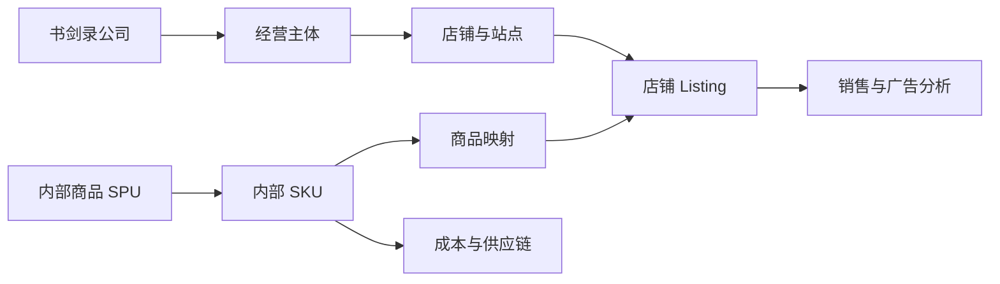

# 书剑录 ERP 功能规划

讨论稿 v0.4 · 2026-09-09

本轮开发里程碑、任务进度和资料准备见 [开发执行计划](development-plan.md)，实现方式见 [Web ERP 技术方案](erp-technical-plan.md)。

本次按用户补充改为灵活作业：业务可直接操作，标准流程仅生成可调整待办，完整规则见 [灵活作业与工作台待办](weekly-operations-workflow.md)。本文描述目标设计，功能是否已实现以开发计划和实施记录为准。

## 1. 产品定位

面向书剑录公司内部的中文 Web ERP，服务美国站亚马逊多店铺业务。用户已确认主要使用亚马逊 FBA。日常操作允许自由创建采购、分析和发货记录；标准流程通过事件与日历生成工作台待办，帮助记住下单、生产跟进、发货和经营分析。周度节奏为可选模板，经营利润、广告和财务按真实单据分析核算。

系统重点回答：各店铺和商品赚多少钱；哪些商品需要补货或清库存；采购及在途货物到哪里了；广告花费是否有效；今天的问题由谁处理。

本轮假设销售主要以 USD 计价、采购支持 CNY，老板、运营、采购及财务多人使用。实际店铺名称、经营主体、仓库和人员规模待录入。海外仓、FBM 按实际需求扩展。

本轮范围已确认：原一期、二期功能全部建设；订单和广告由人员从亚马逊导出，再手动导入 ERP。API 自动同步留待后续，当前开发不依赖 Amazon 开发者资格或接口授权。

为完成库存和财务流程，建议库存、交易、结算及费用数据也通过报表导入；内部采购、收发货、物流和付款由人员在 ERP 登记。可按依赖分批开发，但不将采购、仓库、头程和财务月结移出本轮交付范围。

## 2. 功能总览

| 模块 | 核心功能 | 本轮建设内容 | 后续可选扩展 |
| --- | --- | --- | --- |
| 待办工作台 | 我的逾期、今日、未来和未定日期待办 | 手工事项、采购/生产/发货事件提醒、每日下载和周五分析；完成、改期、取消及业务跳转，经营摘要辅助 | 更多个人视图 |
| 店铺与团队 | 店铺档案、经营主体、品牌、负责人和权限 | 多店铺切换、跨店汇总、角色与店铺权限、各类数据覆盖状态 | API 授权和同步状态 |
| 商品中心 | 内部商品、规格、图片、SKU 映射、Listing、成本历史 | 商品档案、跨店映射、费用估算、采购与头程批次实际成本、资料版本 | 新品开发项目 |
| 数据中心 | 文件导入、校验、去重、匹配、任务记录、来源追溯 | 订单、广告、成本、库存、财务报表导入；错误处理、重传更新、撤回、缺失区间提醒 | API 自动同步 |
| 销售分析与订单 | 每周商品分析、前期对比、行动与明细追溯 | 最近完整 7 天销量/销售额、前 7 天对比、周报版本及导出、转补货、订单及退货退款和赔偿跟踪 | 按需增加更多履约方式 |
| 广告分析 | 花费、曝光、点击、归因销售、ACOS、ROAS、TACOS | 店铺、商品、活动和搜索词报表分析；预算手工维护及超支提醒 | 广告预算、竞价和否词写回 |
| 利润与财务 | 预估利润、周报月报、费用、对账及回款 | 商品/店铺利润、实际费用核算、月结、回款对账、应付和公共费用 | 按需扩展财务系统集成 |
| FBA 库存与补货 | 当前可售、未来供给、预计断货日和建议采购量 | FBA 快照与在途去重、内部仓库流水、按交期和每周频率补货、旧采购余量核对、人工调整和转采购 | 高级需求预测 |
| 采购与供货 | 供应商、报价、自由建单、预计发货、进度和交付 | 单据关联提醒、可选接单/齐货跟进、未交余量、分批交货、质检、入库、退货和应付 | 供应商评价和自动比价 |
| 发货与入仓 | 独立发货单、可选批次、Amazon 货件、实际发出与接收 | 多采购来源及多货件分配、装箱、实发差异、运输节点、FBA 接收核对和成本归集 | 物流接口和时效预测 |
| 运营与风险 | 运营任务、Listing 问题、账户健康和资料到期 | 异常待办、责任人、截止时间、处理记录、合规资料及账户问题台账 | 运营实验与自动采集 |
| 系统设置 | 币种、汇率、时区、费用规则、日志、导出和备份 | 基础配置、字段权限、审批配置、站内提醒、审计及恢复方案 | 外部消息渠道及更多集成 |

## 3. 关键模块设计

### 3.1 待办工作台：安排今天要做的事

默认显示「我的待办」，分为逾期、今天、未来和未定日期；可查已完成/已取消事项，按店铺、负责人和业务类型筛选。每条包含标题、时间、关联单据、来源规则及备注，提供完成、改期、取消、编辑和打开关联页面。待办、未读通知和机器后台任务分别统计。

标准模板支持以下规则，启用后自动生成，也可按单据逐项添加或关闭：

| 触发 | 时间 | 待办 |
| --- | --- | --- |
| 新建采购单且尚未下单 | 下一次周一 09:00，一次性 | 向供应商下单 |
| 预计发货日期 | 提前 2 个自然日 | 确认生产进度 |
| 预计发货日期 | 当天 | 跟进发货 |
| 固定周期 | 每天 15:00，含周末 | 下载经营数据 |
| 固定周期 | 每周五 | 分析销售与库存 |

未指定时分的事项默认全天待办，可自行设置时间；预计发货日期缺失不妨碍保存采购单，相关规则待补日期。预计发货与预计到货为不同字段。周一 09:00 尚未过去时可取当日，否则下一周一，实际日期可调整。

所有模块允许直接操作：不要求先生成周度批次、发布周报、完成下单/齐货提醒再发货。标准模板不是审批或操作门禁，待办逾期不锁单。数量、金额、权限和库存过账校验保留，按业务操作本身执行。

待办用待处理、已完成、已取消三个状态，逾期由日期计算；不强制认领、处理中或复核。勾选完成不改变采购/发货事实，阅读通知不自动完成待办；登记实际已下单或所关联批次全部实发可按明确规则完成相应事项。下载与分析默认手动完成，不从点击页面、导入一个文件推断任务已做完。

业务改期只更新仍跟随日期的未完成提醒；手工改期默认独立，已完成/已取消不被复活。分批发出只结束相应批次的提醒，其他余量继续跟进；重复调度不重复建待办。周期事项可选只改本次或修改以后，取消本次不停止整个周期。单据取消、规则启停及补生成细则见工作流文档。

下方保留销售、库存、采购与发货摘要，可选本周视图。所有快捷入口保留单据/筛选关联，但直接建单不要求存在上游分析来源。

### 3.1.1 销售周表：从销量变化直接进入补货决策

默认按店铺报告时区取最近 7 个完整自然日，并对比此前 7 天；国内周五执行时若美国站周四未结束，清楚展示实际截止日期。含未结束日的手选范围标为临时分析，不能发布为完整周报。

一行对应一个店铺 Listing，主要列为图片/商品、Seller SKU、7 天销量和销售额、前期销量、环比、日均销量、FBA 可售、预计断货日、按时可达供给、建议采购量、供应商、行动备注。原销售记录保留为订单明细视图；零销量但有库存或未完采购的商品也进入清单。

补货默认使用经样本确认的有效订购量（已发货和已确认未取消的待发货）；取消、待付款、未知状态分列。覆盖不全、前期缺失、零基数、新品及断货期均显式标记。广告花费和利润是增强列，缺失不阻断基础销量分析；缺失的利润不能显示为 0。

FBA 补货仅纳入对应 FBA 履约销量，FBM 分列；销量、可售及采购先统一基础计量单位，套装和箱规有明确换算。

周报发布保存来源、汇总结果、期间、时区、版本和备注，后续重传只能生成修订版。导出的销售分析表与保存版本一致。勾选商品可生成独立补货方案并保留分析依据，周度标签可选；也可直接人工创建采购，不以发布周报为前提。

### 3.2 店铺与商品：统一商品身份，保留店铺差异

公司下维护经营主体、店铺、站点和负责人，允许同一负责人管理多个店铺。品牌与店铺独立维护。



- 内部 SPU 表示产品系列，内部 SKU 表示可独立采购、存储和核算的规格。
- Listing 维护店铺、站点、Seller SKU、ASIN、FNSKU、父子变体关系和履约方式；相关标识按实际数据允许暂缺。
- Seller SKU 在店铺和站点范围内识别，不能因字符串相同自动合并不同店铺的商品。
- ASIN 不作为跨店库存或成本的唯一关联键；跨店汇总通过已确认的内部 SKU 映射完成。
- 同一内部商品可以对应多个店铺 Listing，各店铺保留自己的售价、广告、库存和业绩。
- 商品维护负责人、供应商、尺寸重量、装箱数、采购周期、图片、资料附件和生命周期状态。
- 成本有币种、生效日期、来源和版本。修改成本后是否重算历史结果须显式选择并留下记录。

### 3.3 利润与财务：区分日常预估、期间汇总和月结

| 视图 | 用途 | 数据与状态 |
| --- | --- | --- |
| 日常预估利润 | 及时发现经营问题 | 订单、广告、有效成本和估算费用；标记数据缺口 |
| 周报 / 月经营汇总 | 团队复盘和商品比较 | 固定期间及计算版本；已核对费用和估算费用分列 |
| 月度已核对经营利润 | 核实该期间的经营结果 | 交易、结算、广告、仓储、成本及其他费用核对完成后结账 |

公司净利润还需纳入工资、办公、软件、服务等公司费用及明确的核算规则，不能把商品贡献利润直接命名为公司净利润。最终分类和核算口径由业务与财务共同确定。

建议的管理报表结构：

```text
商品净销售收入 = 商品销售收入 - 促销折扣 - 销售退款
商品贡献利润 = 商品净销售收入 + 归属商品的其他经营收入
             - 已售商品成本 - 已售商品分摊头程
             - 平台销售与履约费用 - 广告费用
             - 仓储及其他可归属经营费用
店铺经营利润 = 商品贡献利润汇总 - 店铺公共费用 + 未分配调整项
公司经营结果 = 店铺经营利润汇总 - 公司公共费用 + 公司级调整项
```

公式是待确认的分类框架。来源金额若已包含折扣或退款，应先标准化，不能再次扣减。销售税、代收代缴、赔偿、退货成本转回和汇兑单独分类，按确认后的口径纳入。

关键规则：

- 分别保存订单销售、财务入账和银行到账时间。利润和回款分开展示。
- 订单文件不能默认提供全部实际平台费用；缺少费用时使用明确的估算项，并展示覆盖率。
- 平台佣金、FBA 配送、仓储、入仓相关费用、移除/弃置和退款相关费用采用可配置类别，费率保留生效日期。
- 采购货款与已售商品成本分开记录，进货付款不直接等同于当期商品成本。
- 退货退款记录商品是否回到可售库存及处置结果，不能对所有退款自动转回全部成本。
- 广告报表花费与财务广告扣款建立核对关系，同一费用只计入一次利润。
- 店铺公共费用可保留为未分配；需要分摊时保存规则和原始总额。
- 保存 USD 原币和 CNY 换算，记录汇率来源、适用日期及版本。
- 月结支持“草稿 → 待核对 → 已结账”。已结账数据修改需反结账或生成有记录的调整版本。

### 3.4 广告分析：让广告花费与商品利润关联

本轮优先支持 Sponsored Products 报表，其他广告类型根据实际投放补充。商品、活动和搜索词使用各自对应的导出报表，不从汇总数据反推不存在的明细。

- 按店铺、内部商品、广告商品和 Campaign 分析。
- 指标包括曝光、点击、CTR、CPC、归因订单、归因销售、ACOS、ROAS 和 TACOS。
- ACOS = 广告花费 / 广告归因销售额；TACOS = 广告花费 / 同口径总销售额。分母为零时标记不可计算。
- 保留归因窗口、报告时间语义、广告类型、币种和更新时间，支持延迟数据回补。
- 广告归因销售与订单销售不简单相加；“总销售减广告销售”不能直接标记为精确自然销售。
- 无法可靠匹配商品的广告费用保留到店铺或活动层级，显示未分配金额。
- 无转化花费、ACOS 过高和预算偏离的阈值由团队配置，并显示观察周期和样本量。
- 本轮提供搜索词报表分析、预算手工维护、基于已导入花费的预算预警，以及调整建议和执行记录。预算、竞价和否词实际在亚马逊后台操作；API 写回留待后续。

### 3.5 库存与补货：同时管理数量、时间和资金

分别展示国内仓、海外仓（如有）、运输在途、FBA 入仓、FBA 可售、预留及不可售库存。内部运输记录与 Amazon 入仓状态关联到同一货物，避免重复统计在途数量。

本轮建议人工导入 FBA 库存和库龄报表，保存报表日期、库存状态和源文件。ERP 内部出入库通过业务单据登记，FBA 库存以导入快照及相关记录核对，不只靠销售订单倒推。

主视图将「当前 FBA 可售」与「未来供给」分列；运输在途、接收中、已齐待发和已确认未交是不同供给阶段，同一货物只计一次。FBA 人工接收账不代表可售库存，不能加到 Amazon 当前快照上；只有汇总在途、无法与内部货件核对重合时，受影响商品的自动建议标为不完整，显示差异来源；仍允许手工决定采购量，不将差异待办作为建单门禁。

本轮优先提供 7 天销量及前 7 天对比，14/30 天作辅助观察。可售天数只使用当前可售量；未来供给按预计转可售日期列出，另算第一个需求无法覆盖的日期。零销量不能显示无限可售天数，过期或缺失快照不能作为可靠的自动补货依据。

同时建设仓库和补货功能：

- 出入库、调拨、占用、释放、盘点和报损流水，接收差异单独处理。
- 商品采购周期、运输周期、入仓缓冲时间、安全库存和补货频率。
- 检查间隔默认 7 天、可调整，保护期 = 本次决策到新采购转可售的提前期 + 检查间隔 + 安全天数。优先用实际预计发货日计算提前期；周末发货仅为可选排期，不限制其他日操作。
- 原始建议量 = max(0, ceil(日需求 × 保护期 − 当前 FBA 可售 − 保护期内可达的已有有效供给))。安全库存若按件数配置，不再叠加安全天数；正建议量再考虑 MOQ 和箱规。
- 有效供给排除延误、取消及已计入库存的数量。同一批货在采购、运输和 FBA 入仓状态间迁移时不能重复扣除。
- 保护期总量足够但到货前会断货时，仍提示常规补货来不及。未确认或延期旧单单独提醒处理，不能把它们忽略后直接重复采购。
- 采购补货与 FBA 发货建议分别计算，考虑国内存货、起订量、整箱数、交期和仓容约束。
- 标记缺货期、促销、季节性、新品和销量突变，支持人工调整并说明原因。
- 库存成本、在途资金、周转及库龄分析。

跨店铺货权和库存独立记录，调配要有真实业务单据和受支持的履约路径，不能只修改所属店铺字段。

### 3.6 采购、仓库与头程：每一批货都有来源和去向

采购、供货与发货分别有独立入口，关联来源时自动带入资料。可直接创建采购，按需记接单/生产/可交量，也可以一次录入真实发货及其来源分配，不必补点每个标准流程步骤。

采购保存商品、数量、价格、币种、预计发货日期、交期、备注；创建后在关联待办中预览可选提醒。已实际下单与仅创建草稿分开表达。未交部分保留原单，不因周五或切周重新采购；供应商确认及生产跟进日期可自由安排。

计划可在齐货前准备，预计数量不冒充仓内实物。实发操作校验来源未交余量/可用库存及分配，计划60只发50时，仅50转在途，余10保留或释放预留。部分接收与差异继续保存，已过账数量不能被勾选待办或普通编辑改变。

发货可独立登记，也可按任意发货日分组，支持同店多采购来源、多 Amazon 货件和装箱分配。Amazon 货件由人员在后台创建，ERP 保存对应编号；未完成建货件提醒不阻止补录实际发出，编号暂缺时标待补充，可另建待办。

供应商直发按实际交运记录供货，国内集货按实际收货/质检/出库记录；不要求所有订单经过国内仓。采购交付、FBA 接收和当前可售分开，旧累计接收字段保留原义。权限及既有明确审批配置仍适用，不新增由周度模板强制的申请/审批步骤。

### 3.7 运营与异常：提醒要落实到责任人

包括商品负责人、Listing 资料、价格与活动记录、图片/A+ 任务、问题记录和复盘。新品立项、样品及完整项目看板后续扩展。

账户健康与合规问题记录类别、影响商品、截止时间、附件、负责人和处理过程。本轮采用人工登记和附件上传，问题状态由责任人维护。

Amazon Seller Central 已覆盖订单、库存、营销、支付及账户健康等业务入口；ERP 的建设重点是跨店汇总、内部供应链、成本核算和团队协作。[Seller Central 功能概览](https://sell.amazon.com/tools/seller-central)

日常跟进使用待处理、已完成、已取消，认领和复核不作为统一必经步骤。确有专项审批需求时独立配置。支持去重、改期、备注与历史，完成待办不等于关闭尚有余额或差异的业务单据。

## 4. 用户与权限

| 角色 | 主要工作 | 默认数据范围建议 |
| --- | --- | --- |
| 老板 / 管理层 | 公司经营、店铺比较、资金和审批 | 全公司汇总及授权明细 |
| 运营负责人 | 店铺业绩、商品、广告、补货和团队任务 | 管理范围内店铺 |
| 运营专员 | 所负责商品和店铺的日常操作 | 指定店铺及商品；成本和利润按授权开放 |
| 采购 / 供应链 | 供应商、采购、交期、物流和库存 | 授权采购与供应链数据 |
| 仓库人员（如有） | 收发货、库存和盘点 | 指定仓库；默认不开放利润 |
| 财务 | 成本、费用、应付、回款、对账和月结 | 授权主体及店铺的财务数据 |
| 系统管理员 | 账号、权限、配置、接口和审计 | 系统管理；经营数据查看权另行授予 |

权限覆盖功能、店铺/主体、敏感字段和操作类型。数据隔离在服务端执行，并同样作用于搜索、导出、附件、汇总报表和后台任务。

成本修改、导入撤回、财务调整、审批、月结和权限变更保留操作人、时间、前后值及原因。本轮通过文件交换亚马逊数据，不需要在 ERP 保存卖家后台登录凭据。

## 5. 数据接入与质量

订单和广告已确定采用人工导出、手动导入。以下库存和财务数据也建议采用文件导入，避免采购、补货和月结依赖接口接入。内部业务单据在 ERP 录入，标准化数据层为将来接入接口保留扩展能力。

| 数据 | 本轮维护方式 | 主要用途 |
| --- | --- | --- |
| 店铺与商品 | 手工维护、商品档案导入 | 店铺归属、商品身份和跨店映射 |
| 订单与销售 | 从亚马逊导出订单/发货报告后手动导入 | 订单、状态、销量和销售额 |
| 广告 | 从广告后台导出商品、活动、搜索词等实际使用的报表后导入 | 广告效果、预算预警和费用归属 |
| 交易、结算与费用 | 交易、结算、仓储及其他实际费用明细导入 | 费用核对、退款、赔偿、回款及月结 |
| FBA 库存与库龄 | 库存、库龄及接收/退货等所需明细导入 | 库存状态、补货、接收差异及退货分析 |
| 成本与采购 | 成本表导入；采购、质检、收货和退货在 ERP 登记 | 成本版本、采购进度、实际批次成本和应付 |
| 仓库与物流 | ERP 出入库、盘点、装箱、物流节点和费用登记 | 内部库存流水、在途数量和头程成本 |
| 回款与公共支出 | 手工登记或导入收款、付款及费用明细，上传凭证 | 银行到账核对、应付、公共费用和资金记录 |

订单及广告报表可支持销售分析和预估利润；要完成已核对利润和月结，还需实际交易、费用、成本及回款等数据。各指标只在所需来源齐备后标记完整。

本轮支持与实际样本匹配的 XLSX、CSV 和制表符 TXT/TSV 解析器，提供 ERP 自有成本、期初库存及费用模板。PDF 和其他凭证可作为附件保存，自动识别不列入当前要求。

导入流程：选择店铺及报告类型 → 上传 → 预检和覆盖范围预览 → 处理错误与映射 → 确认入库 → 展示结果及异常。

导入中心需要实现：

1. 按店铺和数据类型管理导入任务，支持一次上传多个文件，每个文件明确所属店铺及报告类型。
2. 识别表头、日期、币种和编码，展示行数、期间、金额汇总及预览；缺失元数据由用户明确填写，不静默猜测。
3. 显示新增、更新、重复、冲突和错误数量，确认后入库；错误行可下载修正，阻断错误处理前不发布该批次。
4. 保存源文件、导入人、时间及版本；从分析结果追溯到来源记录。
5. 重传或日期重叠时按对应报告的粒度处理。订单状态、广告归因回补及财务事件使用各自的更新规则，不将同一份数据重复累加。
6. 展示各店铺“订单更新到哪天、广告更新到哪天、库存快照日期、月结资料是否齐全”，可设置站内补导提醒。
7. 撤回和重算需验证权限及下游影响；不能删除其他批次有效记录，已结账期间按调整或反结账流程处理。
8. 图表、预警和利润在导入成功后刷新，并显示数据截至日期。区间汇总报表不生成伪造的每日数据。

不同来源若描述同一业务，例如订单报告和发货报告中的同一订单项，应建立关联并按统计口径选取，不能把两者销量相加。

质量要求：

- 保存源文件、批次、店铺、报告类型、覆盖期间、币种、时区、解析版本及文件摘要。
- 按来源真实粒度定义记录标识，不能只用 SKU 和日期去重订单或费用。
- 相同文件重传不重复记账；日期重叠时区分新增、更新和冲突；库存快照不累加。
- 订单状态和广告回补可更新；费用与退款按事件去重，不能覆盖真实的多笔交易。
- 缺成本、未匹配 SKU、未知费用类别、币种混用和日期缺口进入异常清单。
- 分别保存购买、发货、财务入账时间；报表有明确的统计日期与时区，处理美国时区夏令时。
- 原币与换算分开保存，不直接相加 USD 和 CNY。
- 导入撤回识别下游报表和月结影响，失败任务显示原因及处理建议。
- 本轮订单分析不依赖买家姓名、地址等个人信息，只采集所需订单字段。

## 6. 本轮网站导航与交互

```text
书剑录 ERP
├─ 工作台
│  ├─ 我的待办与今日安排
│  ├─ 提醒规则与周期事项
│  └─ 采购、出货与经营摘要
├─ 销售分析
│  ├─ 商品周表与历史周报
│  └─ 销售订单明细
├─ FBA 库存与补货
│  ├─ 可售与未来供给
│  ├─ 补货方案与断货风险
│  ├─ 内部仓库、流水与盘点
│  └─ 库龄与库存资金分析
├─ 采购与供货
│  ├─ 采购订单与供应商确认
│  └─ 供货跟进与未交余量
├─ 发货与入仓
│  ├─ 发货计划、可选批次与装箱
│  ├─ Amazon 货件与实际出货
│  └─ 在途、接收差异与费用分摊
├─ 经营分析
│  ├─ 广告分析
│  └─ 利润与经营报表
├─ 财务管理
│  ├─ 费用与分摊
│  ├─ 应付与收付款
│  ├─ 交易结算与回款对账
│  └─ 月结与调整
├─ 基础资料
│  ├─ 商品档案、店铺映射与补货参数
│  ├─ 供应商、报价与物流方案
│  └─ 成本管理
├─ 任务与风险
│  ├─ 待办与审批
│  └─ 账户问题与合规资料
├─ 数据中心
│  ├─ 本期销售、库存及其他报表导入
│  └─ 数据异常
└─ 设置
   ├─ 店铺与团队
   └─ 币种、口径与系统配置
```

以上导航均属于本轮建设。新品开发项目、运营实验、广告写回和高级预测留待后续扩展。

界面以桌面浏览器及数据表格为主，支持筛选、排序、固定列、字段选择、保存视图、批量处理和权限内导出。商品详情集中呈现资料、各店铺表现、广告、利润、库存及关联采购物流。

手机端优先支持经营摘要、待办和审批。数据页覆盖空数据、加载中、导入失败、权限不足、来源过期和部分缺失状态。

## 7. 本轮开发顺序与完整验收

原一期和二期合并为同一轮建设，按依赖顺序分批开发。以下顺序不改变最终交付范围。

2026-09-09 优先顺序调整为：待办工作台 → 固定周期与单据事件提醒 → 改期/取消/拆批联动，再继续销售、库存与供货增强。提醒基础不依赖完整补货模型。详细映射见 [开发计划](development-plan.md#31-当前优先交付待办与灵活作业)。以下保留总体建设范围。

1. 基础数据和权限：登录、店铺、团队、商品映射、成本版本、供应商、仓库、期初数据及配置。
2. 导入与经营分析：订单、广告、库存和财务导入，销售、广告、预估利润、经营报表及异常任务。
3. 采购与货物流转：采购审批、质检到货、出入库、装箱、头程、FBA 接收差异、实际成本和补货建议。
4. 财务与整体验收：费用分摊、应付、收付款、对账、月结、公司汇总、权限和恢复验证。

完整验收标准：

1. 用至少两个店铺的真实样本跑通流程，同名 Seller SKU 不串店，跨店合并由映射控制。
2. 文件重传不重复计算，日期重叠和更新数据有确定处理结果。
3. 销量、销售额、广告花费和成本可核对到来源，差异可解释。
4. 能从店铺查看到商品及明细，并导出周报和月经营汇总；时间口径、计算版本和费用覆盖状态清晰。
5. 缺成本或费用未齐时显示预估/不完整状态，不输出无提示的完整利润结论。
6. 库存预警标明快照日期及依据，可分配负责人并记录处理。
7. 权限覆盖页面、接口、导出和附件；核心数据具备可验证的备份恢复方式。
8. 一批货能从采购追踪到分批收货、发出、FBA 接收和费用归集；取消、退货、短收等差异有处理记录。
9. 库存变动有单据，补货建议可解释；同一在途货物在多个来源中不重复计数。
10. 采购、物流、广告及其他费用能核对且不重复计入，应付余额和付款记录一致，回款差异可定位。
11. 能完成一个月的核对、结账和有记录的调整，已结账结果不会被重传文件静默改写。
12. 订单、广告、FBA 库存和财务分析通过人工文件导入完成；无 API 授权也能运行本轮业务流程。

预估经营汇总和已结账报表分别标记。验证重点为解析、去重、金额计算、时间边界、成本版本、库存流转、对账、月结及权限隔离。

上线前准备店铺、商品映射、成本、供应商、仓库、期初库存、在途货物和未结应付款，确定切换日期，避免期初记录与后续业务单据重复计入。

### 后续可选扩展

API 自动同步、新品开发、供应商评价、广告操作写回、高级销售预测、运营实验、更多履约方式和外部协作集成。

自动竞价、自动改价及自动下采购单等能力，在数据质量、操作权限和可验证业务规则成熟后逐项引入。

## 8. 后续业务确认资料

已确认：美国站、多店铺、Web 网站、主要使用 FBA；原一期二期均建设；订单和广告由人员从亚马逊导出后手动导入。

2026-09-09 明确：标准节奏只用于提醒，业务顺序和日期灵活。提醒包括采购创建后周一09:00下单、预计发货前两天确认生产、当天发货、每天15:00下载经营数据、每周五分析销售与库存，均进入工作台并可调整。规则见 [工作流设计](weekly-operations-workflow.md)。

开发具体规则前补齐：

- 店铺、品牌、所属经营主体和负责人。
- 国内仓、供应商直发、第三方仓及海外仓的实际使用方式。
- 从实际发出到 FBA 可售的常见天数、运输方式、接收缓冲、MOQ、箱规和安全量；缺失时展示待配置，不使用公式示例作为默认经营参数。
- 团队角色及人数，成本和利润可见范围。
- 订单、广告、库存、费用及成本样例，现有周报/月报规则。
- 各类报表的导出样式、统计粒度、导入频率及维护责任人；库存与财务文件建议采用同样的导入方式。
- 成本计价方法、费用分摊、汇率来源、统计时区和月结规则。

原仓库的文件解析思路可复用；多人 Web ERP 需要重新规划身份认证、服务端权限、持久化存储、后台任务、文件管理和恢复机制。
