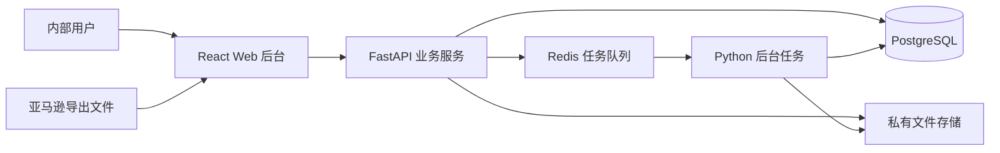

# 书剑录 Web ERP 技术方案

版本：v1.2 · 2026-09-09

状态：M1 已按本方案开始实现；前后端工程、迁移及后台任务已初始化，依赖通过锁文件固定。当前实现与验收范围见 [实施记录](implementation-log.md)，后续业务模块仍按计划推进。

产品范围见 [ERP 功能规划](erp-product-plan.md)，执行任务见 [开发执行计划](development-plan.md)。早期本地分析工具方案保留在 [历史技术方案](technical-plan.md)。

本次按 [灵活作业与工作台待办](weekly-operations-workflow.md) 修订技术边界（第 8.1–8.2 节）。待办和提醒规则优先实施，业务无需按固定周期串行推进；W0 的 tasks 模块与迁移 48b7a65dc109 已实现；W1–W5 仍为待实现方案，运行语义见 [待办使用说明](task-workbench.md)。

## 1. 总体实现方式

采用 React 中文管理后台、FastAPI 业务服务、PostgreSQL 数据库和独立 Python 后台任务进程。后端按业务模块组织，共用一套持久化数据和权限机制。订单、广告及外部报表均从手动上传进入系统。



导入、解析、重算和大报表导出通过任务执行，网页查询任务进度。数据库保存任务及业务状态，队列承担调度。用户关闭网页后，已提交任务仍可继续；任务失败不能导致数据半导入。

## 2. 技术基线

| 层 | 规划采用 | 使用方式 |
| --- | --- | --- |
| 前端 | React、TypeScript、Vite、Ant Design | 中文后台布局、表格、筛选、表单和详情页；统一 API 客户端 |
| 后端 | Python、FastAPI、Pydantic | REST API、字段校验、权限和业务服务 |
| 持久化 | PostgreSQL、SQLAlchemy、Alembic | 关系数据、事务、约束、索引及可追踪迁移 |
| 文件处理 | pandas、openpyxl、标准 CSV 解析及编码识别 | 针对实际报表的适配器；逐行或分块处理较大文件 |
| 后台任务 | RQ、Redis、独立 Python worker | 解析、导入、报表重算及导出；业务层实现重复执行保护 |
| 文件存储 | 私有存储接口，开发环境使用持久化目录 | 源文件、商品图片、单据附件和导出结果；生产落点根据部署环境配置 |
| 验证 | pytest、前端类型/构建检查、Playwright 关键流程 | 业务规则、数据库行为、权限及端到端操作 |
| 运行 | 可重复的本地启动配置及 Docker Compose 配置 | API、Web、worker、数据库和队列；提供环境变量示例 |

选型参考：Ant Design 的 [Table 文档](https://ant.design/components/table/) 提供后台表格能力；FastAPI 的 [后台任务说明](https://fastapi.tiangolo.com/tutorial/background-tasks/) 区分请求后的任务与更重的后台工作；[RQ 文档](https://python-rq.org/docs/) 描述 Python 队列任务。独立 worker 是本项目为导入恢复和资源隔离作出的设计选择。

具体语言和依赖版本在 M1 根据兼容性选定并锁定，项目不使用浮动的 latest 作为可重复运行依据。图表库在 M4 按实际图表需求选择，避免提前扩大依赖。

## 3. 计划目录

```text
SJLERP/
├─ apps/
│  ├─ web/                     前端应用
│  └─ api/
│     ├─ app/
│     │  ├─ core/              配置、数据库、认证、权限和审计
│     │  ├─ modules/           按业务组织的接口与服务
│     │  ├─ ingestion/         报表解析、预检、标准化和导入策略
│     │  ├─ jobs/              后台任务和恢复调度
│     │  └─ storage/           文件存储接口
│     ├─ migrations/           数据库迁移
│     └─ tests/                业务与集成验证
├─ tests/e2e/                  浏览器关键流程
├─ infra/                      本地运行及部署配置
└─ docs/                       功能、计划、技术和操作说明
```

这是总体目录规划，已实现目录见仓库，尚未实现的业务模块随里程碑创建。真实报表和凭证放在私有数据目录，仓库测试样例使用脱敏或虚构数据。M1 已加入忽略规则和环境变量示例。

## 4. 业务模块与数据边界

| 模块 | 主要数据对象 | 关键关系与约束 |
| --- | --- | --- |
| 组织与权限 | 公司、经营主体、店铺、品牌、用户、角色、授权范围、会话 | 业务对象有明确归属；管理员管理权限和经营数据查看权限分别表达 |
| 商品与成本 | SPU、内部 SKU、店铺 Listing、映射历史、成本版本、汇率版本 | Listing 按店铺/站点识别；映射与成本变更可追溯 |
| 数据导入 | 源文件、导入批次、解析版本、暂存行、错误、规范事实版本、来源关联、后台任务 | 文件、原始行和规范事实相互可追溯；导入版本独立于源文件保存 |
| 销售与广告 | 订单、订单项、发货关联、退款/退货/赔偿、广告活动和不同粒度报告事实 | 订单和发货描述同一销量；多种广告报表描述的同一花费不能叠加 |
| 库存 | 仓库、批次、出入库单、库存流水、占用、FBA 快照、库存核对 | 内部账和 FBA 外部快照分别管理；变动由业务单据产生 |
| 采购 | 供应商、报价、申请、审批、采购单/行、质检、分批收货、供应商退货 | 已采购、已到货、取消及退货数量分别记录 |
| 物流与补货 | 发货单/行、箱/箱内明细、运输节点、接收事件、差异、运费分摊、补货建议 | 采购、发货、箱和接收允许一对多；供给状态迁移不重复计数 |
| 灵活作业与待办 | 待办、提醒规则、周期实例、触发/完成事件、单据来源；可选分析与发货分组 | 待办完成与业务状态独立；通知已读不等于已完成；日期/步骤不锁业务；数量与权限由原模块负责 |
| 财务 | 交易事件、费用分类、应付、预付、付款/分配、到账、结算、公共费用及分摊 | 原始财务事件与管理分类分开，保留未分配金额和差异 |
| 利润与月结 | 计算运行、输入版本、利润结果、期间、核对项、结账快照、调整 | 已结账结果有不可变快照；后续数据通过明确的调整流程处理 |
| 协作与系统 | 任务、审批动作、账户问题、合规资料、通知、附件、审计日志 | 责任人、期限和状态明确；附件及导出继承所属对象权限 |

业务表按实际归属设置公司、经营主体、店铺或仓库范围，不强制把跨店共享商品或公司公共费用绑定到某一家店铺。服务端验证引用对象的主体和授权范围，不能仅凭前端传来的 store_id 信任归属。

## 5. 登录、权限与接口

- 采用内部账号和服务端会话，浏览器通过 HttpOnly Cookie 维护登录。配置有效期、账号停用失效、登录频率限制及变更请求的 CSRF 防护。
- 权限判断包含当前用户、功能、操作、数据范围及敏感字段。列表、详情、汇总、搜索、下载和后台作业都执行相同范围限制。
- 单据变更保留审计记录；已过账数据不能通过普通编辑删除，采用冲销或调整。
- API 按 `/api/v1/` 和业务模块组织，统一分页、排序、筛选、错误结构及请求标识。
- 金额通过明确的十进制格式传递；空值表达缺失，不用零掩盖数据问题。
- 提交导入、生成大报表等返回任务标识；任务结果和文件下载再次验证访问权限。执行写入前重新验证发起用户是否仍有相应权限。

## 6. 导入与后台任务

### 6.1 状态与提交流程

```text
已上传 → 解析中 → 预检完成 / 有阻断错误
预检完成 → 待确认 → 入库中 → 已完成
解析或入库失败 → 失败原因及可恢复步骤 → 授权重试
已完成 → 影响检查 → 授权撤回或生成修正版
```

源文件保存后先生成暂存数据和预检结果。用户确认报告归属、期间和数据变化后再提交规范事实。解析与预检不能直接改动经营报表。

小批次采用事务提交；较大批次采用候选版本写入和原子发布。发布前不向业务查询暴露半成品数据。事实提交后标记受影响的统计期间，后台重算成功后再切换报表版本。

### 6.2 去重、覆盖与重传

- 文件摘要用于识别同一来源文件，但业务去重还需要店铺、报告类型及规范事实键。
- 按真实来源确定订单项标识；缺少稳定标识时定义并验证可重复的替代键，不能只使用 SKU 和日期。
- 同一期间的广告报表保留维度、粒度和归因窗口。活动、商品及搜索词数据用于各自分析；利润选定可核对的花费来源，避免跨报表重复累加。
- 订单状态与广告回补按版本更新；退款、费用等按独立事件识别；FBA 库存按快照读取。
- 重叠报告的更新规则区分“完整覆盖该范围的快照”和“增量事件”，不能无条件删除旧范围后插入新文件。
- 原始来源、规范事实及计算输入保留关联，导入撤回恢复有效版本，不删除其他批次仍在引用的数据。
- 成本、映射、分类或输入变更需识别受影响期间；已结账期间不能自动重算覆盖。

### 6.3 任务可靠性

- 数据库保存任务意图、状态、尝试次数和结果，避免只依赖队列中的临时信息。
- 入队失败或 worker 中断后，可根据数据库状态恢复调度；领取和执行均有重复保护。
- 数据库唯一约束、事务及必要的范围锁处理并发导入，不能只靠按钮禁用。
- 上传限制、解压和解析资源限制、最大行数及保留期限可配置；根据真实文件规模确定默认值。
- 队列只接收后端定义的任务及安全参数，不允许用户提交任意函数或执行内容。
- 失败显示可操作的错误说明；重试不重复发布数据或重复产生库存、费用记录。

## 7. 金额、时间与核算

金额使用 Python Decimal 和 PostgreSQL NUMERIC，明确原币精度、计算精度、汇率精度及最终舍入位置。PostgreSQL 官方文档将 NUMERIC 归为精确数值类型，适合作为此处的存储基础。[Numeric Types](https://www.postgresql.org/docs/current/datatype-numeric.html)

销售、财务入账和到账分别保存事件时间；有时区的事件保存统一时间及来源时区，只有报告日期的数据保留日期粒度。统计使用可配置 IANA 时区，处理夏令时，不能用固定 UTC 偏移代替全年规则。

预估利润以有效日期对应的标准成本和费用估算计算；实际利润以核对后的交易、费用、计价结果及分摊版本计算。财务费用不直接从订单占位字段假定得到。

实际已售商品成本的计价方法、退货转回方式和公共费用分摊是业务决策，M7 实际利润验收前确定。数据库保留批次、数量、采购及头程成本来源，以支持确认后的计价方法；不能将物流批次跟踪直接宣称为每笔 FBA 销售的实物批次。

每次利润计算保存：期间、输入批次/事实版本、SKU 映射版本、费用分类、成本与汇率版本、分摊规则、算法版本、完整性状态及结果。用户可从结果查看具体来源和计算明细。

## 8. 库存与单据一致性

- 内部库存通过已过账流水增加或减少，余额由流水核对；FBA 快照是外部观测，不再按 ERP 销量重复扣减快照。
- 库存占用、出库、释放在事务中验证可用量，重复提交同一单据不能重复产生流水。
- 采购、收货、发货、运输和接收使用关联明细及数量守恒检查；分批、短收、退货、报损分别表达。
- 同一货物从国内仓变为在途、再变为 FBA 接收时迁移状态，不能在多个阶段同时计为有效供给。
- 供应商直发按实际货权和发出节点登记，不制造未发生的国内仓收发货。
- 补货建议保存输入日期、销量窗口、交期、安全库存、有效供给和人工调整原因，支持从建议生成采购/发货草稿。

### 8.1 灵活业务的技术边界

当前实现依据 `app/reports/`、`app/supply/` 与 `app/models.py`；以下为「现状 → 变化」，具体接口与迁移在 W0–W5 分批实施时细化：

| 当前实现 | 目标变化及约束 |
| --- | --- |
| `Product` 为共享商品，销售直接保存 Seller SKU；商品参考 ASIN/FNSKU 没有店铺映射语义 | 增加店铺/站点 Listing 及有历史的内部商品映射；不按共享参考字段自动绑定。补货按 Listing 计算，供给按真实分配使用一次 |
| 销售按 UTC 日期筛选，快捷范围按浏览器日历；导入批次没有明确完整覆盖声明 | 增加报告时区、声明期间、生成时间及覆盖性质；新周报由店铺时区计算半开区间再转换查询边界。旧明细行为保留并显示原口径，不静默改变既有筛选 |
| 报表重传更新当前销售事实 | 周报保存已计算结果及使用的规范事实快照/不可变版本引用、汇总与调整；仅保存可变 `SalesRecord.id` 不足以复现历史。补导生成修订，采购来源仍指向原确认版本 |
| `InventoryBalance` 包含人工 FBA 接收余额；未接 Amazon 库存快照 | 新增外部 FBA 快照和来源核对层，保持内部流水独立；不把历史接收余额当可售期初，不用周销量直接冲减外部快照 |
| `PurchaseOrder.status` 提交后为 ordered；`PurchaseLine.received_quantity` 表示货件目的仓接收 | 新增供应商确认、截至当次未交可交量版本、交付事件与计划分配；采购决策、供应商履约及目的仓接收为独立维度，旧字段/流水保留原义 |
| `Shipment` 限一张采购单或一个源仓，头部只有一个 Amazon Shipment ID | 保留现有子货件及其库存事务，上层按需增加店铺归属的发货分组；外部 Amazon 货件及行分配独立建模，可跨多个同店子货件分配。一个物流运单可关联多个同店批次/货件 |
| 当前确认发出整张计划数量 | 增加计划来源分配与实际发出明细；部分实发在同一事务拆分余量、迁移/释放原占用，防止原计划和新子货件同时保留同一占用；已过账记录用差异动作纠正 |

模块职责：`reports` 负责销售和库存外部来源、覆盖与事实版本；`supply` 负责采购确认、实物与单据守恒；分析增强放独立 `planning`，负责可选周报/补货版本与供给时间线，不直接写 `InventoryBalance`。待办归独立 `tasks`，不以 planning 为依赖；工作台只读取授权内待办及经营聚合。

周度分组是可选标签，无 `(store_id, anchor_friday)` 唯一门禁，允许同周多次采购/分析及不分组直接操作。实际单据继续明确店铺和来源；提醒日期和模板步骤不进入采购/发货可操作性判断。库存来源分配、并发及权限校验仍执行。

补货计算以共同截止时点汇合销量、FBA 可售和有效供给，保存快照时间差、销量口径、L/R/安全量、路线、MOQ/箱规、供给分配及人工调整。先按供给到达日期检测缺口，再计算保护期目标量。ETA 未知、SKU 无映射或在途无法去重时，自动建议显示数据缺口；人工创建采购可独立选择已建商品和数量，不要求先完成数据核对待办，不编造系统估算值。

写入仍复用会话、CSRF、服务端店铺权限与审计。生成采购使用「批次修订 + 决策行 + 已分配量」和请求幂等保护；减少供应商可交量、分配发货、部分实发、取消余量在一致顺序的行锁中检查数量。接口返回版本冲突时要求刷新最新差异，不能最后写入者覆盖已经承诺的数量。

主要验收守恒：采购下单 100、当次齐货 60、计划 60、实发 50 → 已交付 50，未交 50（待发可交 10 + 未齐 40），实际在途 50；接收 30 后剩余待收 20，FBA 可售仍取有效快照。同一快照或发货操作重试不得再次增量，跨两个周五再次分析仍读取原采购余量。

迁移采用增量建表及可空关联。旧单可以继续原流程；只对有明确来源的历史记录建立确认/分配关系，无法判断的供应商承诺标为未核对，不把全部 ordered 单批量认定已接单。旧单头的 Amazon Shipment ID 仅在核对店铺和分配后转为外部货件关系，不能仅按相同字符串跨店合并。上线前核对未完订单、源仓占用、运输在途及已接收账的迁移前后数量，备份数据库和源文件，并保留旧查询兼容路径。

### 8.2 待办、规则与可靠触发

现状：`Notification` 只有收件人、标题、消息、已读状态；`Job` 是机器执行任务，`Approval` 是审批。`worker.py` 当前处理队列恢复，没有业务提醒调度。新建独立模型与服务，不用已读标记或 Job.status 表示人的工作是否完成。

| 新对象 | 关键数据与职责 |
| --- | --- |
| Task | 标题、负责人、状态、日期/具体时间、全天标记、时区、来源规则/单据、作用店铺范围、跟随日期或手动覆盖、完成/取消记录；支持无来源的手工待办 |
| ReminderRule | 是否启用、事件或周期、偏移天数/周几/时分、业务日期字段、负责人/范围、完成条件；保存配置版本及生效区间 |
| TaskOccurrence / 触发身份 | 固定周期的原计划日/时刻或单据动作身份，约束唯一；实例改期不改变原发生身份 |
| TaskEvent / Delivery | 日期变更、人工与业务完成、取消/恢复、通知投递与去重记录，支持历史追溯 |
| 业务事件记录 | 采购创建/实际下单、预计发货改期、明确生产确认、分批实发、取消；与单据事务一起保存供任务服务消费 |

W0 最小业务扩展包括独立 `planned_ship_date`（或冻结契约后的等价字段）、真实下单事件和对现有实发的完成判断。现有 `expected_date` 为到货/交期，不能直接当发货日减两天。供应商直发、国内发货以及拆出的批次按各自来源范围关联提醒，不能同一采购余量同时被订单级和批次级提醒重复覆盖。

待办服务只消费事件，不参与标准业务状态门禁。真实操作可以在一个事务中建立必要来源分配并登记实发，未填写单独供应商确认/齐货记录不要求补点流程。事件意图与业务变更原子保存，提醒生成在后台重试；提醒投递失败不回滚已成功的采购/出库，工作台展示同步状态，不伪称提醒已经送达。

事件去重键按规则、业务来源和动作实例稳定确定，日期变更更新同一未完成 Task，不按每次保存创建新任务。周期实例按规则、明确的负责人/业务范围及原计划周期唯一；规则配置版本不应直接变成新的重复实例身份。人工覆盖、已完成/取消、并发改期和自动完成使用版本校验及行锁串行处理。

所有周期按规则的 IANA 时区计算，保存原计划本地日期和 UTC 时刻；本轮模板 Asia/Shanghai。全天事项只有日期，在当地日结束后逾期；定时事项到时提醒，实例可提前出现在未来列表。周一09:00一次性、每天15:00与每周五的周期语义分别实现，不把一次下单提醒误设成永久周循环。其他时区的夏令时歧义需定义只生成一次的解析规则，不能按固定UTC偏移跨季节推算。

后端定时扫描/调度与长耗时导入任务隔离，不依赖浏览器页签或长任务结束后的循环空档；数据库保存待触发意图和游标，队列仅承担执行。重启分批补齐启用时段遗漏的实例，保留原日期、不自动标完成；停用时段不补生成，过去多条通知合并摘要。投递前重新核对任务状态、日期版本、规则通知设置和店铺权限，旧时间、已取消或已完成的消息不再发送。

可选自动完成必须对应明确事实：登记已下单完成一次下单待办；关联批次全部实际发出完成该批发货待办；一次明确生产进度确认只对应本次跟进。任意备注、点击页面、通知已读、单个文件导入均不推断下载/分析完成；手动完成任务也不反向记账。

待办的列表、详情、跨店范围、来源链接、导出、通知和后台处理均检查当前权限。默认负责人来自创建人或规则配置；委派须验证对方可访问对象。来源撤权后不能在历史通知文本继续暴露单号/金额等信息，业务类通知需要关联来源并在读取时核验；此能力不能依赖现有无来源检查的纯消息结构。

迁移增量加入任务及规则表，不把历史未读通知批量转换成逾期待办。模板按用户选定范围启用，不在上线时给全部历史采购强制补任务；后台事件补消费只补已启用规则范围。初次发布需验证重复调度、日期移动、提前完成、部分实发、权限变化及离线恢复；W0已接入独立本地scheduler，模板由账号在工作台启用。

## 9. 财务月结与调整

- 财务交易原始数据、费用分类、付款事实和经营利润保持关联但分别记录；银行回款不作为利润。
- 费用分摊保存原额、依据、明细及尾差处理，明细之和必须等于待分摊总额。
- 广告报表与广告扣款、仓储明细与财务扣款建立对应关系；差异保留，不把所有来源重复计费。
- 月结流程为资料检查 → 费用/成本/回款核对 → 差异处理 → 生成快照 → 结账锁定。
- 月结不完整或差异未解决时，按明确规则阻止结账或要求有权限的人员记录处理依据。
- 补到费用、成本修正和源文件撤回必须检查期间锁；通过调整版本或授权反结账处理并保留前后结果。

## 10. 验证和运行交付

关键业务验证使用真实 PostgreSQL 行为，覆盖事务、约束、并发、库存守恒及期间锁定。纯解析和公式验证采用可核对样例，前端端到端验证覆盖关键跨模块操作。

基础检查包括后端测试、前端类型检查与构建、数据库迁移验证；每个模块只增加与其风险和业务规则相关的验证。M8 汇总环境、数据规模、耗时及恢复结果，不虚构未经测量的性能保证。

目标运行结构为 HTTPS 入口、Web/API、worker、私有数据库与队列、持久化文件存储。开发/测试/生产配置分开。本地开发环境已运行并完成基础集成验证；生产部署当前仅编制方案，目标服务器、域名、访问方式和数据规模在交付前确定。

备份覆盖数据库和原始文件，演练应核对二者的引用一致性。上线前明确恢复点/恢复时间目标、保留期限、备份调度、部署回退和期初切换检查表。开发环境的虚构样例和正式经营数据分开。


### W0 实现映射（2026-09-09）

`app/tasks/` 实现 Task、TaskRule、RuleSchedule、TaskHistory、SourceEvent、TaskOperation 和 TaskNotice。周期规则保存生效区间与扫描游标，实例键为规则+原始日期；单据键为规则+来源类型+单据ID；手动事项以请求号幂等。日期、负责人、状态变更带版本校验；投递独立使用 schedule_version/notified_version，转派或改期会产生新的通知机会。

业务事务只追加 SourceEvent，独立 scheduler 在与供应链一致的采购→货件锁顺序下重新读取来源，避免旧事件覆盖新日期；每条事件以保存点隔离，失败记录重试次数、异常类型与下一次时间，按最多1小时退避。周期每单元最多90个自然日，单轮最多30单元；投递每轮最多200项，并按负责人汇总。TaskNotice 保存汇总通知的全部关联任务，权限变化后按任一仍可访问任务判断可见性。

RuleSchedule 用 next_run_at 控制下次扫描；规则编辑以 PostgreSQL FOR NO KEY UPDATE 与外键 KEY SHARE 兼容，避免编辑与实例生成的锁反序。新表按负责人/店铺/状态/日期、来源、投递和事件扫描建立索引；列表与历史均有服务端上限。没有新增外部队列或云端定时服务。
