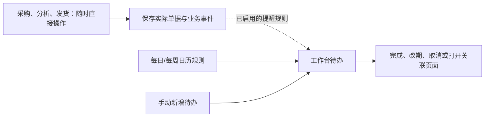

# 灵活作业与工作台待办

设计版本 v1.1 · 2026-09-09。根据用户补充，标准流程用于提示与生成待办，日常操作保持灵活。本文为目标设计，页面、接口和数据库尚未按此改造，交付状态见 [开发计划](development-plan.md)。

## 1. 设计原则：业务独立操作，流程提供提醒

采购、销售分析、库存、发货均可从各自页面直接操作，也可从工作台待办进入。用户可以先采购、临时补货、提前发货、补录业务或跳过暂时不需要的跟进步骤。周五分析、周四齐货、周末发货是可选工作习惯，日期、顺序和周度批次均不成为业务前置条件。

系统分为三层：业务单据记录实际发生的事情；提醒规则根据事件或日历生成待办；工作台集中安排这些待办。标准模板可整体或逐项启停，单据保存无需先选模板或处理提醒弹窗。周度分组仅是可选视图/标签，可以不分组，也可以同一周有多次采购和分析。

**待办没完成、已延期或已取消，都不阻止采购或发货。** 数量、金额、货权、权限及已过账流水的正确性校验仍由业务单据负责；这些校验不会要求用户先把工作流每一步点完。

用户原有周节奏保留为模板参考。采购数量、承诺可交数量、计划量、实发量和 FBA 接收量分别保存，用于解释事实与差异。



### 1.1 内置提醒模板

提醒使用 Asia/Shanghai 日历；用户可以改时区、周期、时间及负责人，与销售报表统计时区分开。模板启用后自动生成，也可在保存单据后的「关联待办」中新增、调整或关闭。

| 模板 | 触发依据 | 默认时间 | 待办与完成方式 |
| --- | --- | --- | --- |
| 采购下单提醒 | 创建采购单且尚未登记实际下单 | 下一个尚未过去的周一 09:00；一次性 | 「向供应商下单 · 采购单号」；手动完成，或登记实际已下单后自动完成 |
| 生产进度确认 | 采购单/供货批填写预计发货日期 | 预计发货前 2 个自然日 | 「确认生产进度 · 单号/批次」；手动完成，或由明确的本次进度确认记录完成 |
| 发货提醒 | 采购单/出货批填写预计发货日期 | 预计发货当天 | 「跟进发货 · 单号/批次」；手动完成，或对应待发数量全部实际发出后自动完成 |
| 下载经营数据 | 固定周期规则 | 每天 15:00，含周末 | 「下载经营数据」；可跳转导入中心，默认手动完成 |
| 销售与库存分析 | 固定周期规则 | 每周五 | 「分析销售数据与库存情况」；进入销售/库存页面，默认手动完成 |

用户只指定下单提醒的 09:00 和每日下载的 15:00；其余默认全天待办，可自行设置具体时分，不擅自固定为 09:00。全天任务当天显示待办，过完该日才标逾期；未设时分不制造一个定时弹窗。每天的下载和周五分析是两个独立事项，周五同时出现。

采购下单模板针对每张单只生成一次，不每周重复催同一张单。若周一 09:00 尚未过去，取当日，否则取下一周一，预览显示具体日期，用户可立即改期。直接创建一张已下单的记录时不生成未完成的下单提醒。生产进度与发货提醒不依赖下单提醒是否完成。

「预计发货日期」是供应商/相应批次计划发出的日期，独立于预计到货日期；不能把现有到货 expected_date 直接用作触发依据。没有发货日期也可以保存采购单，对应规则显示「待填写日期」，不瞎猜时间、不产生假逾期。按规则算出的日期已过去时，待办以逾期显示一次，允许改期或取消。

例如 2026-09-11 创建采购单，预计 09-18 发货：下单提醒 09-14 09:00，生产进度确认 09-16，发货提醒 09-18。期间随时可以完成实际下单、提前发出或改期，无须等到提醒日。

### 1.2 工作台如何使用

- 默认「我的待办」，按逾期、今天、未来、未定日期组织；提供已完成/已取消记录及「新增待办」。工作量、采购和销售摘要置于待办之后，可另选本周采购/出货视图。
- 每条显示标题、提醒/截止时间、负责人、店铺或范围、关联单据、来源（规则或手动）、简短备注。点击可直达采购单、发货单或分析页，保留已有筛选。
- 常用动作是完成、稍后提醒/改期、取消本次、编辑、打开业务页面；只在需要委派时选择负责人，默认创建人/规则负责人，不强制认领、处理中、复核等中间步骤。
- 状态为待处理、已完成、已取消；逾期由时间计算，改期只调整时间。支持恢复误完成/误取消并留变更记录；普通完成/改期不强制填写说明。
- 完成待办不代替采购提交、真实下单、出库、接收或库存调整；阅读通知也不等于完成待办。实际事件可按明确条件完成对应待办，不能由查看页面或保存普通备注推断完成。
- 周期待办可选择「仅本次」或「本次及以后」调整；完成/取消某次不停止下一次。关闭规则停止未来生成，已存在待办默认保留，提供批量取消入口。

### 1.3 改期、拆批与提醒合并

1. 每条事件待办有「跟随业务日期」开关。默认跟随：预计发货改期时更新尚未完成的生产进度和发货待办，保留原日期记录；下单提醒不随发货日移动。已发提醒历史保留，不继续在旧时间触发。
2. 手动改过时间的待办默认变为独立时间，不被业务改期覆盖；显示业务日期已变，用户可重新选择跟随。已完成/已取消事项不因编辑单据或重跑规则而复活，确需再次跟进时显式新增一次。
3. 分批供货时按实际供货/出货批跟进。拆批同步原未完成待办的来源和覆盖数量，保留关联，避免订单级、批次级为同一批货重复催。一个批次完成仅结束其待办，原单其他未发余量继续单独跟进。
4. 取消采购未交部分或出货批，取消对应失去对象的规则待办；部分取消不影响其他有效批次。独立手工待办默认保留并显示来源变化，可自行取消。
5. 重试保存、重复调度、多人操作均不重复生成同一事件待办或周期实例。默认到时在工作台突出显示；站内通知可配置，每次触发最多一条，逾期不每天堆通知，持续催办另设规则。
6. 周期按日/周各保留一个实例；昨天未完成不阻止今天生成。工作台可折叠积压、批量完成或取消，仍保留每期记录，不能静默标完成。停机恢复分批补生成启用期间遗漏的实例，保留原日期并标逾期，过往多条通知合成一条恢复摘要。
7. 默认每个负责人一条周期事项，涵盖规则明确选择的店铺范围；可按需拆店，不默认每店复制一组提醒。范围和负责人变更继承业务权限，撤权后不再展示或发送相关业务内容。

规则修改默认影响未生成的未来实例；已生成事项保留单次改期/完成/取消，批量应用时明确选择范围。模板停用再启用从重新启用时向后生成，不补停用期间事项。日期变化、完成、取消、拆批与重试按同一事件身份处理，避免互相覆盖。

## 2. 日期、销售及数据完整性

### 固定可比的 7 天窗口

- 国内下单和出货日历默认使用 Asia/Shanghai；销售按店铺确认的报告时区统计，保存 IANA 时区及实际起止时间。两者分开，不用浏览器时区代替销售口径。
- 默认取执行分析时，店铺报告时区中最近 7 个完整自然日；对比紧邻的前 7 天。若周五执行时报告时区的周四已经结束，窗口通常为上周五至本周四。
- 国内周五上午美国站周四可能尚未结束。此时默认截至最近已结束的报告日，并明确展示日期；若用户选择包含未结束日，则标记「临时分析」，不能作为完整周报发布。仍可保存、导出带数据限制说明的分析，或直接人工创建采购，无须先发布完整周报。
- 已结束不代表数据已经齐全。导入批次需要记录报告声明的覆盖起止、生成时间及完整/增量性质；不能从订单最早/最晚日期推断覆盖完整，也不能把无订单的一天自动判断为漏导。
- 分析和采购可在任意日期创建；周度分组可选，同一周可有多个独立方案。补导修订已保存的分析版本，不自动新建采购；从同一方案转单仍防止重复生成。

### 销售分析表

一行对应一个店铺 Listing（店铺 + 站点 + Seller SKU），关联已确认的内部 SKU。默认展示商品图片、名称、Seller SKU、7 天销量/销售额、前 7 天销量、环比、日均销量、FBA 可售、预计断货日、按时可达供给、建议采购量、供应商及处理意见。广告、利润、14/30 天趋势放在可选列或详情，数据缺失不妨碍基础销量分析。

FBA 补货只采用对应 FBA 履约需求，FBM 销售单列；无法识别履约方式的行进入核对。销量、库存与采购统一到已确认的基础计量单位，套装/多件装与供应商箱规须有明确换算，不能把一箱、一套和一件直接相加。

建议把「有效订购量」作为补货需求基数：已发货 + 已确认且未取消的待发货数量；取消、待付款及未知状态单列，状态映射必须随真实报告样本核对，不从有金额推断订单已确认。展示已发货数量供核对；订单状态后续变化生成新分析版本。退货不自动等量抵减未来需求，退回可售量以库存来源确认。

日均销量 = 有效订购量 / 7；只有 7 天覆盖完整时使用这个分母。前期销量为 0 时显示「新增销量」或「两期均无销量」，不显示无限增长率。缺前期数据标为缺失。销售额沿用订单报告的金额定义，按币种分列，不将其命名为利润。

清单还要纳入有库存、有未完采购或已启用的补货 Listing，不能只从销售行生成，避免漏掉本周零销量商品。零销量、新品、断货期间、促销及销量突变进入人工复核；不自动推导无限可售天数。新品可填人工日需求并记录依据。

发布周报保存：销售期间、数据覆盖、来源版本、汇总结果、库存快照、参数及人工备注。销售底表以后更新不能静默改变已发布周报。Excel 导出与当前保存版本一致，包含口径、日期、缺失标记和来源说明；不能读取导出当天的其他版本拼成历史周报。

## 3. 库存：把数量与预计可售日期一起看

用户日常所说的「FBA 可售库存（含在途）」在页面分成「当前可售」与「补货覆盖量」两组，保留合计辅助判断，但在途不进入当前可售天数。

| 数量 | 来源与计算 | 补货使用方式 |
| --- | --- | --- |
| FBA 当前可售 | 最近有效、已确认的 Amazon 库存快照 | 作为起点；显示截至时间，不再按已包含的历史销量重复扣减 |
| FBA 预留、处理中、不可售 | 对应来源的互斥状态或明确的明细分类 | 单列；不自动加入当前可售，预计释放有依据时才列未来供给 |
| 已发出未转可售 | 内部实际发货、运输/接收记录与外部货件状态核对后的余量 | 按预计转可售日期纳入；运输、接收中阶段不重复累计 |
| 国内可发库存 | 实物减其他计划占用；属于当前店铺 | 只有分配了可执行运输方案、预计按时转可售才扣减采购需求 |
| 已确认采购未交量 | 已确认订单余量及承诺交期 | 经后续出货、运输、接收日历换算后进入未来供给 |
| 已齐待发 | 最近记录的可交量或已备妥现货 | 是既有采购/库存的阶段，不再作为新增的一份库存相加 |
| 未确认、延期或交期未知采购 | 原采购单余量 | 风险供给单列，人工核对后再决定是否追加；不能忽略旧单自动重买 |

核心规则：

1. 同一件货在「已确认未交 → 齐货待发 → 运输 → 接收中 → 当前可售」之间迁移，只归一个供给阶段。明细关联采购行、库存分配、内部发货行与 Amazon 货件行。
2. 外部在途与 ERP 货件优先按店铺、Amazon Shipment ID、Seller SKU/FNSKU 核对。只有 SKU 汇总、无法识别重合货物时，不把两个在途总量相加，也不直接取最大值冒充准确结果；受影响行标为待核对，自动建议标为不完整并展示需核对来源，用户仍可填写人工采购量，不以数据核对待办作为建单前置。
3. FBA 已接收不等于已可售。人工接收只更新物流/接收账；可售量由快照读取。跨时间来源用快照时点和接收事件关联切分，未证明已包含或已释放的重合部分进入差异清单，不能把历史累计接收量加到当前快照上。
4. 同一次快照重传不累加；同日多份完整快照按有效版本读取；部分文件不覆盖未包含的商品。历史快照可追溯，过期快照明确提示。过期阈值按业务配置，上线前核对，不伪设成实时库存。
5. 同一内部商品对应多个店铺/Listing 时先独立计算需求，再按真实货权与分配记录分配供给；同一国内库存或采购余量不得被两行建议重复扣减。

## 4. 补货：提供可解释建议，允许自主决策

### 先判断会不会来不及，再计算买多少

自动补货估算可配置供应商交期、国内备货时间、可选发货窗口、运输/接收时长、安全量、箱规和 MOQ。建议复查间隔默认 7 天，可调整；不限制用户在其他时间补货。运输时长未知时显示估算缺口，仍允许人工确定数量直接采购。

预计转可售日 = 用户填写的预计实际发货日 + 运输时间 + 接收转可售缓冲。未指定日期时可根据供应商交期和可选发货窗口估算，标明估算来源；周五/周六只作为可选模板，不能强制推迟其他日期的发货。

设 L 为决策截止时点至本次新采购预计转可售日的天数，R 为复查间隔（默认 7 天），B 为安全天数，d 为已确认日需求。保护期 H = L + R + B。

```text
原始建议采购量 = max(0, ceil(d × H − A − E(H)))
A = 同一计算截止时点可采用的 FBA 当前可售量
E(H) = 已有供给中、预计在保护期内转可售的去重数量
```

计算保存共同截止时点；销售、快照及履约数据与该时点的时差逐项展示。较早快照如用于推演，须明确保存推演区间及估计消耗，不得再次减去快照之前的销售；无法可靠推演时标记数据不足。若安全库存按件数配置，则改用 d × (L + R) + 安全件数，不能再加 B 天安全量。

只有原始建议量大于 0 才应用 MOQ，再按箱规向上取整；MOQ 按供应商约定区分 SKU 或整单。缺报价/MOQ/箱规时显示缺项和原始建议量，用户可直接填写本次采购量及价格，不要求先补齐全部默认资料。展示原始量、取整增加量、最终确认量和调整原因，允许部分采购或本周不补。

总量充足仍可能中途断货。按日期列出 d 的预计消耗与每笔供给转可售日期，计算第一个无法覆盖需求的日期。若断货早于本次新采购可售日，列为「常规补货来不及」，提示运营评估现货调配、加急运输、调整销售安排等行动，系统不自动执行。

例（仅为公式验收，非实际交期）：d=10，L=28，R=7，B=7，A=90；已有有效供给 80 件在第 14 天、30 件和 20 件在第 28 天可售。目标 420 件，已有 220 件，原始建议 200 件，24 件/箱且 MOQ 已满足时建议 216 件。当前可售只能覆盖 9 天，第 14 天到货前仍有断货风险，不能因为保护期合计足够而显示安全。

### 防止每周重复采购

- 计算读取所有历史未完订单、待发和在途，不只读取本周批次。
- 同一需求行按「已转采购分配量」记录已转单数量，包含仍待提交或待供应商确认的有效采购草稿/单据。再次生成只允许未分配余量；并发或重试不重复建单。取消/删除尚未下单的草稿时释放分配，已下单的余量通过取消记录处理。
- 未确认/严重延误旧单不作为确定能到的供给，但要弹出原单、数量、交期与处理选项。可选择保留等待、改期、取消未交余量或手动追加，提示旧单风险，但不增加强制审批或必须先取消旧单的限制；系统不自动下第二张单。
- 已冻结建议重算产生新版本和差额；已下单的数量、单价与旧依据保留，变更走明确追加或取消流程。

## 5. 采购、供货跟进与实际出货

### 采购单：记录下单与供应商履约

提供「待确认、供货中、部分齐货、部分交付、全部交付」等事实标签和筛选，不是必须逐一执行的流程状态。可以直接建采购或登记实际发货，不要求先有周报、补货方案、确认待办或齐货待办。ERP 提交/审批通过与供应商接单分开表达。确认量、承诺交期、拒绝/取消量、确认人、确认时间及凭据按行保存；缺失确认不能默认等于采购数量。

采购订单可发给供应商的清单包含商品、规格、下单量、单价/币种、包装要求和期望交期；ERP 生成文件供人发送，当前设计不自动联系供应商。按店铺保存真实采购单，同一供应商的多店订单可导出分组汇总，但不能混淆货权和付款币种。审批沿用权限及金额规则；小团队可配置不需额外审批，不强制叠加申请、审批、下单三次相同录入。

需要时填写「供货进度/可交数量」，按采购行记录**截至本次确认、尚未交付的可交数量**、确认时间和可交日期，保留修订历史；不是累计新增入库。页面显示采购量、已交付、取消、未交余量、本周可交、已预留本周量、未齐量和下次交期。

已记录的可交量不得超过未交余量，实物/承诺预留不得重复占用。计划可在齐货前创建，未齐部分标预计、不得冒充可用库存。实际发出校验采购未交余量或源仓可用量，可在一次操作内记录实发与来源分配，无须先补点确认/齐货步骤。跟进日期由提醒规则和用户安排，不固定到周三或周四；待办逾期不取消订单。

### 发货计划：先确定实物来源，再对应 Amazon 货件

可以直接建发货单，也可按任意实际出货日将多张发货单加入可选批次；批次按店铺归属，可包含多个供应商订单及该店国内仓现货；公司界面并排汇总各店批次，明细保存来源分配。批次下再按目的地、实际路线和 Amazon 货件拆分。一个物流运单可关联多个批次及 Amazon Shipment ID，一个商品来源也可以被分到多个 Amazon 货件；每个分配量守恒。

亚马逊后台操作仍由人完成。ERP 先提供确认后的 Seller SKU/FNSKU、数量和装箱准备清单，后台生成货件后回填编号、目的地与实际分配；不承诺未经实际模板核验的后台直接导入格式。后台要求拆分或数量变化时，展示差异并更新计划版本，再确认一致。

发货页面按实际记录展示计划、实发、在途、接收和差异。未填写齐货跟进或未完成建货件提醒不阻止记录真实发出；Amazon 货件编号暂缺时标「待补充」，可添加补录待办，不伪称已在后台建单。普通国内入库无需 Amazon 信息。权限、来源数量和过账守恒仍要校验，已有错误数据不能靠跳过待办写入。

实际点货发出时填写数量，日期不限周五/周六。计划 60 件只发出 50 件时，50 件转在途，剩余 10 件释放原计划占用或明确保留在后续计划；原采购其余未齐的 40 件继续待交。不可将 60 件全标发出，也不能静默抹去计划与实发的 10 件差异。创建 Amazon 货件本身不代表实物发出。

已发出的记录不可直接改数量或取消；短装更正、丢损及接收差异使用有依据的更正/差异记录。接收 30/50 时尚有 20 件待收，30 件进入已接收层，是否可售另由快照核对。

### 两种实际路线

- 供应商直发：供应商交接给承运商时记供应商已交付，直接进入该票头程，不制造国内入库。采购交付与 FBA 接收分开结束。
- 国内集货：供应商到国内仓时登记本次实收与质检/可发量，头程计划占用国内库存，实际发出后扣减实物。供应商声称齐货但尚未到仓的数量只显示预计供给，不变成仓内实物。

实际采用哪条路线可按单据指定；当前未取得用户确认，设计兼容两条，不将任意路线设为既成事实。

## 6. ERP 主要页面调整

| 现有入口 | 调整后的入口 / 重点 | 主要操作 |
| --- | --- | --- |
| 经营工作台 | 待办工作台：逾期、今天、未来、未定日期，业务摘要辅助 | 新增、完成、改期、取消待办；打开相关单据或分析页面 |
| 销售记录 | 销售分析：默认商品周表；原始订单作为明细视图 | 对比两期、筛选异常、记录行动、保存/导出周报、转补货方案 |
| 库存管理 | FBA 库存与补货；内部仓库与流水保留子页 | 查看可售与供给时间线、解释建议量、调整并按供应商转采购 |
| 采购记录 | 自由建单，预计发货日期和关联待办 | 下单、按需记供货进度、调整生产/发货提醒、保留未交余量 |
| 发货进度 | 发货与入仓：计划、后台货件、实际出货、在途/差异四个视图 | 直接建单或按需分组、核对 Shipment ID、分批发出/接收、追踪差异 |
| 数据导入中心 | 随时导入，承接每日下载待办 | 显示覆盖、快照时点、SKU 缺口和导入结果，不成为人工采购的前置 |
| 商品、供应商、报价 | 基础资料：为上述流程提供默认参数 | 店铺映射、交期、MOQ、箱规、运输方案及供货约定 |

首页重点为我的逾期待办、今日待办和即将到期事项，支持按负责人、店铺、业务类型筛选；经营摘要与采购/发货清单位于下方，不展示必须逐项走完的流程进度条。待办数、未读通知数和业务未完数量分别统计。

从关联入口操作时带入店铺、期间、商品与来源编号，减少抄表；直接建单时不要求补录分析或批次来源。全部店铺视图只做授权范围汇总，创建业务单据时必须确定店铺；切店立即清空旧店数据。

权限按动作补齐：运营可在授权店铺分析和提交补货建议；采购确认采购量/金额及供应商承诺；仓库确认齐货、装箱和实发；经理按配置审批与风险放行。一个人可以被授予多个动作权限，不靠切换角色走流程。金额字段、来源附件及导出继续按现有授权隔离。

## 7. 已有能力与优先改造顺序

现状依据：`WorkspacePage.tsx` 仍以账号与准备事项为主；销售保存 Seller SKU 但尚无店铺 Listing 映射；`InventoryBalance` 是内部库存账；采购提交后没有供应商确认或周四齐货明细；当前 `Shipment` 只能选择一张采购单或一个源仓，并保存一个 Amazon Shipment ID。现有明细、流水和幂等机制可复用，不能只改菜单就宣称周度流程已实现。

优先实现待办与规则，不等待库存分析全部完善：

1. 待办工作台与手工新增、完成、改期、取消；每次操作不改变业务事实。
2. 每日 15:00 和每周五周期规则，生成独立待办实例并处理停机恢复、启停与去重。
3. 采购创建/实际下单/预计发货日期/实发事件关联提醒，覆盖改期、拆批和提前处理。
4. 继续补齐销售周表、FBA 快照、可解释补货、多来源发货和核对；与待办连接，但可独立使用。

当前 Notification 只有已读/未读，没有待办负责人、到期时间、周期或业务完成状态；Job 是机器执行任务，Approval 是审批，均不直接用作人的待办。未来新增待办与提醒规则模型，复用现有权限、审计和后台基础，但不依赖浏览器开着计时。

原 M1–M8 范围继续保留。W0 的 ERP 工作台待办与提醒已实现，使用者按需启用模板；不在 Codex、日历或外部应用中创建提醒，也不联系供应商。运输路线、安全量等影响自动补货的参数可以后续补齐，不阻塞先使用工作台待办。
